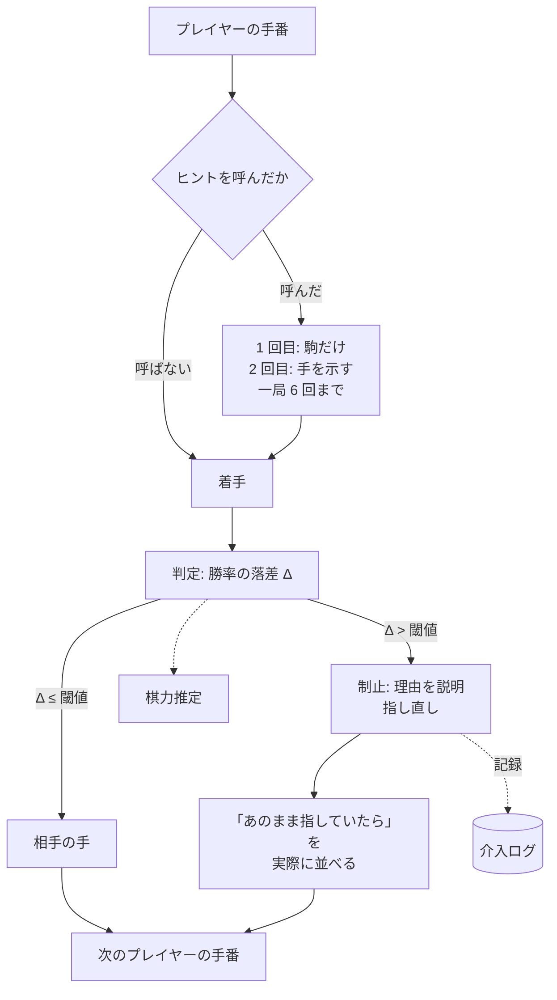
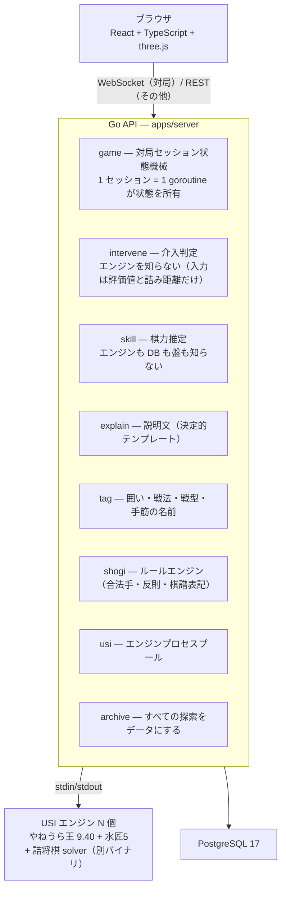

# show-gi — AI が「いつ口を出すか」を自分で決める

[](https://show-gi.com)

> **AI が人の行動に介入するタイミングと強度を、自分で調整するプロダクト。** 検証ドメインは将棋（しょうぎ）です。

**https://show-gi.com** — ログインなしでそのまま一局指せます。

開発ドキュメント（韓国語）は [docs/](docs/README.md) にあります。

---

## 1. 何をするものか

初心者が**大きなミスを指した瞬間だけ**盤が止まり、**なぜ悪いのか**を説明して指し直させます。普段は最善手を見せません。そして相手 AI の強さは、あなたが指した手を見て**一局のうちに**動きます — 師匠の指導対局のように。

### 止めるだけでなく、「なぜ」を盤上で見せる

悪手を検知すると、着手を戻したうえで、何が取られるのかを盤上の攻撃線と短い説明で示します。カードには、その手を戻さずに続けた場合の相手の候補手も並びます。数字だけで「悪手です」と採点するのではなく、**次に何が起きるのかを同じ局面で確かめてから指し直す**ための画面です。

[](https://show-gi.com)

_▲3三角成を戻した瞬間。馬が取られる理由と、そのまま進めた場合の応手を同じ画面で見せています。_

コンピュータ将棋は今も両極端です。弱い設定は駒をあり得ない場所に捨てて自滅し、強い設定はこちらの小さなミス一つで局面がまるごとひっくり返る。**「人が最終的に勝てるところまで連れていく」相手**が、間に一つもありません。

---

## 2. 設計原則は三つだけ

### ① 判定も説明も決定的

悪手かどうか、どのカテゴリか、何が取られるのか — **決定的なルールとエンジンの評価値**が決めます。画面に出る日本語も、その事実からコードが組み立てます。

学習アプリで説明が間違っていると、初心者にはそれを検証する手段がありません。**間違ったことをそのまま覚えます。** だから「この局面どう思う?」と盤ごと生成モデルに投げる経路は、このリポジトリに一本もありません。

同じ事実には必ず同じ文が出ます。カテゴリごとに**言ってよい事実**が決まっていて（`explain.Facts`）、そこに無いものは文に現れません。

### ② 最善手は教えない

手を指してあげた瞬間、人は考えるのをやめます。

- 制止型（悪手のあと）— 「なぜ悪いか」まで
- 詰みゲージ — 手順も手数も出さない。盤の縁が燃えるだけ
- 指したあとの名前（囲い・戦法・戦型）— 「今こうなっている」まで

手を指すヒントは二つあり、**どちらも「頼れない」ことが条件**です。

- **行き詰まりヒント** — 同じ局面で 3 回戻されたらその駒に、5 回で手に印がつきます。5 回失敗しないと開かない扉です
- **呼ぶヒント** — ボタンで呼びます。同じ局面で 1 回目はその駒、2 回目でその手、3 回目はありません。**一局 6 回**なので、答えまで見られるのは最大 3 手です

呼んだ局面の手は**棋力推定から外します**。教えた手をそのまま指したことが実力として記録されると、画面に出る段級が膨らむからです。

**検討画面はこの原則の外にあります。** 手合割をえらんで初手から並べる盤で、そこでは最善手 3 手をそのまま出します — 答えを見に来る画面だからです。だから**対局中はこの画面を出しません**：指している最中に開けると、この節が意味を失うからです。

ただし、その壁は**開いているブラウザのタブの中にしかありません** — 別のタブで開くのを止める仕組みはなく、サーバーは「いま指しているか」を知りません。一人で使う学習アプリなので、そこは仕組みではなく置き方の問題として残しています。

### ③ 探索は必ず深さで打つ。時間で切らない

同じ局面をいつも同じ基準で判定するため、探索は時間ではなく深さで固定します。サーバの混雑で、悪手判定や相手の強さが変わらないためです。

---

## 3. 介入ループ



判定式は評価値をそのまま使わず、**勝率に変換してから落差**を見ます。cp の差は常に同じ重さではありません。互角に近い局面の 300cp と、すでに大差がついた局面の 300cp では、勝つ見込みの変化がまったく違うからです。

$$WR(cp) = \frac{1}{1 + e^{-cp/K}}, \qquad \Delta = WR(\text{最善手後}) - WR(\text{実際の手の後})$$

終盤ではこの式が飽和します（+2000cp から詰みまで Δ 3.5%p）。なので**詰みの距離**に基準を切り替えます — 詰将棋 solver が詰みを見つけた瞬間からがこの製品の「終盤」で、5 手以下の詰みを逃す手だけを止めます。11 手詰めを見逃したのは 8 級にとってミスではないからです。

---

## 4. いま実際に動いているもの

| 機能               | 内容                                                                                  |
| ------------------ | ------------------------------------------------------------------------------------- |
| **対局と介入**     | ルールエンジン・エンジン判定・日本語棋譜。悪手は理由を示して指し直せる                |
| **ヒントと待った** | 行き詰まり時の段階的ヒント、呼ぶヒント（一局 6 回）、待った（一局 3 回）              |
| **適応型の相手**   | 指し手の質から強さを対局中に調整。安全でない候補手は選ばない                          |
| **振り返りと総評** | 評価値グラフ、局面からの分岐、終局後の総評、同じ一局から作るクイズ                    |
| **学習の手掛かり** | 詰みゲージ、囲い・戦法・戦型・手筋のタグ、崩れやすいところ                            |
| **記録とログイン** | ログインなしで対局可能。ログインすれば棋力の変化と中断した局を引き継げる              |
| **友だちと対局**   | 招待リンクで一対一。**入れるのは二人だけ**、持ち時間は一手 60 秒。口出しは出ない      |
| **検討**           | 手合割をえらんで初手から自分で並べ、形勢と**最善手 3 手**を確かめる。対局中は出さない |
| **説明と表示**     | 説明はカテゴリと局面の事実から決定的に組み立てる。盤面は three.js で描く              |
| **あそびかた**     | 介入の流れ、悪手の種類、ヒントの回数を対局前に確認できる                              |

### 一局を、指して終わりにしない

振り返りでは、評価値のグラフがそのまま局面の移動装置になります。赤い点は介入が起きた場所で、選ぶとその時点の盤と候補手が開きます。総評で一局全体を読み、気になった局面では**別の手をその盤で実際に指して**先を確かめられます。

[](https://show-gi.com)

_評価値の軌跡、総評、候補手、盤を一画面に置きました。グラフ上の 36 手目から別の続きを指しているところです。_

### 終わった一局が、そのまま問題になる

一般問題を解くのではなく、**自分がさっき指した一局**から詰み 1 問と最善手 3 問までを作ります。詰み問題は正解するまで答えを出さず、盤の上で王手を続けます。エンジンを採点のたびに呼ぶのではなく、終局時に用意した正解の手順で判定します。

<p align="center">
  <a href="https://show-gi.com"></a>
</p>

_98 手目にあった 7 手詰め。残りの手数と「王手になる手だけ」という条件までを示し、手順そのものは隠します。_

### 3D にしても、読みやすさは落とさない

盤は 3D ですが**遠近法ではありません**。将棋の駒は全部同じ五角形で、漢字だけで区別し、向きで先後を表します。遠近投影を入れた瞬間に奥の漢字が潰れ、相手の駒は裏返しに縦に潰れ、手前が奥を隠す。**学習アプリで判読の負荷を上げると、アプリが自分の目的と戦うことになります。**

---

## 5. 技術構成



| 区分     | 内容                                                                                                                 |
| -------- | -------------------------------------------------------------------------------------------------------------------- |
| サーバ   | Go 単一サービス。対局状態はセッションごとに直列で管理し、探索だけを並行実行                                          |
| エンジン | やねうら王 9.40 + 水匠5。詰み探索には専用 solver を使う                                                              |
| フロント | React + TypeScript + Vite + three.js。合法手の判定はすべてサーバ側                                                   |
| DB       | PostgreSQL 17。対局と解析（局面ごとの評価値キャッシュ）を保存                                                        |
| インフラ | AWS ECS on EC2 スポット 2 台（c6g.large / ARM64、対局用と解析用に分離）+ ALB + RDS + Route53、Terraform、GitHub OIDC |

**対局状態はセッション goroutine 一つが所有します。** 指し直し中に古くなった解析結果は捨て、盤面と説明が食い違わないようにしています。

---

## 6. 開発

```sh
pnpm install
docker compose up -d          # api + db
pnpm dev                      # http://localhost:5173
```

**エンジンが arm64 Debian バイナリなので macOS では直接動きません。** api は必ずコンテナで動かします。

```sh
# 検証
pnpm lint && pnpm typecheck && pnpm test && pnpm build
cd apps/server && gofmt -l . && go vet ./... && go test -race ./...
terraform -chdir=infra fmt -check && terraform -chdir=infra validate
```

> `go test` だけでは全部は回りません。DB・エンジンのテストは環境変数が無いと**静かに skip され、緑に見えます。** 何が要るかは [apps/server/README.md](apps/server/README.md) に表であります。

詳しい構成は [apps/server/README.md](apps/server/README.md) と [apps/web/README.md](apps/web/README.md)、デプロイ手順は [deploy/README.md](deploy/README.md) にあります。

## 7. ライセンス

本体は [MIT](LICENSE)。

将棋エンジン（やねうら王・水匠5 の NNUE 評価関数）は **GPLv3** で、イメージ内でソースからビルドしています。エンジンはパイプの向こう側の別プロセスなので GPL は我々のコードに伝播しませんが、イメージにバイナリを含めることは配布にあたるため、どのタグをビルドしたかを Dockerfile に残しています。

囲い・戦法・戦型の定義は**必須マスの集合**として自分で書き、ルールエンジンが到達を確認しています。個人ブログや書籍の解説文は一行も取り込んでいません — 出典と検証の基準は [docs/09-tags.md](docs/09-tags.md) §0 にあります。
