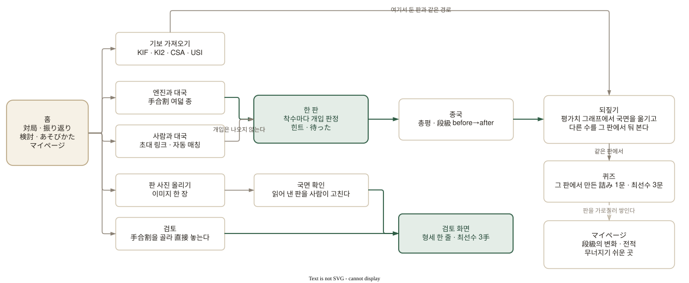
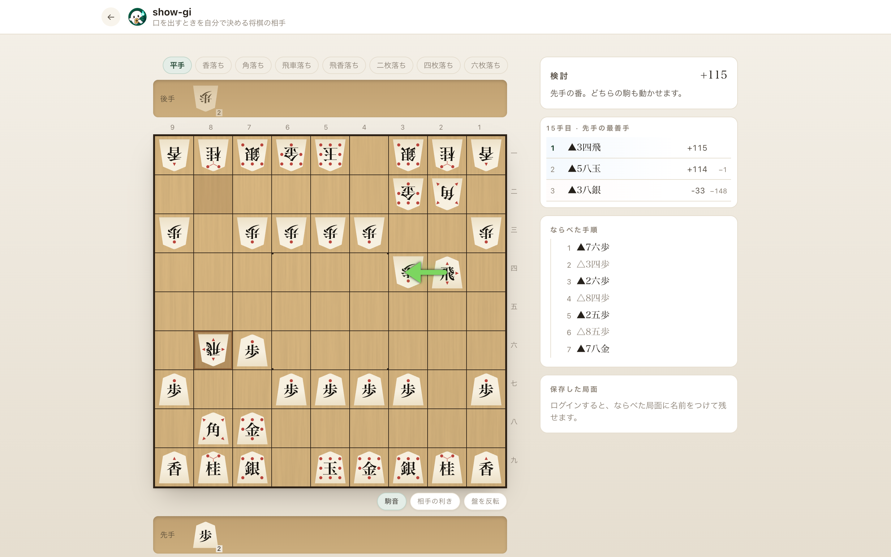
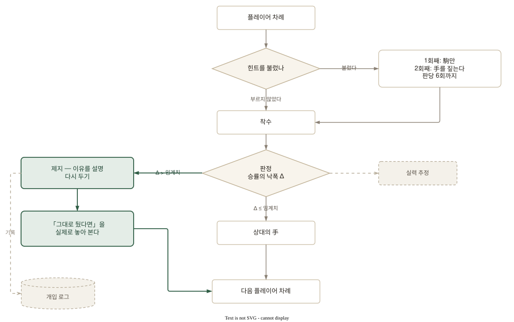
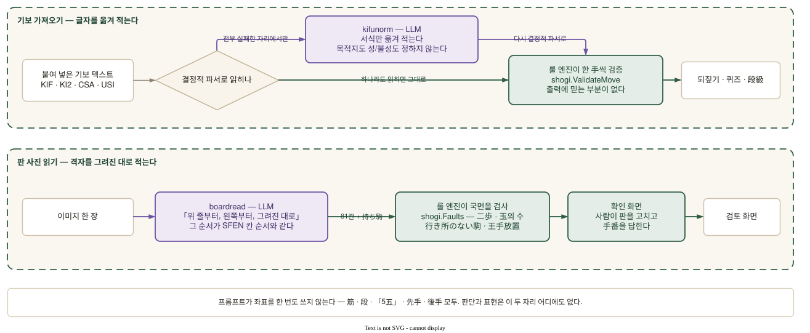
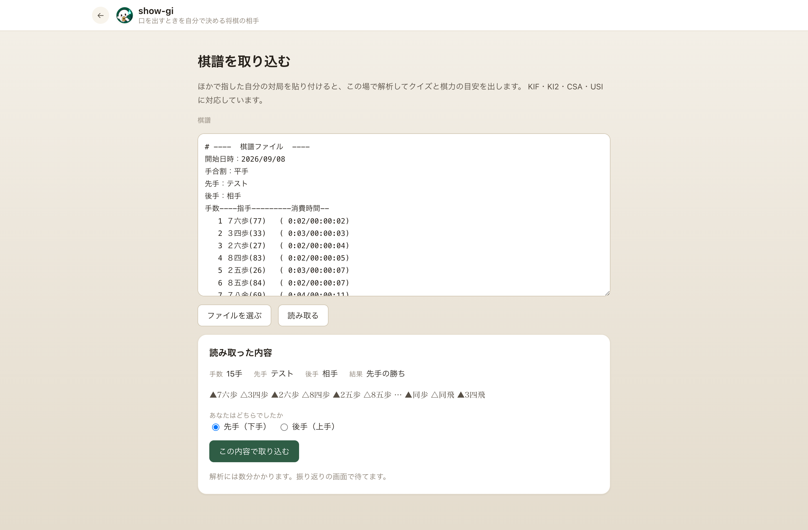
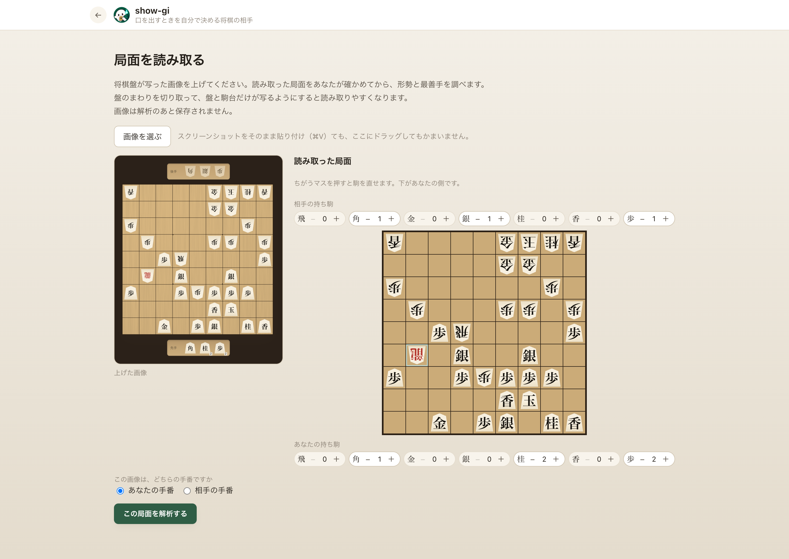
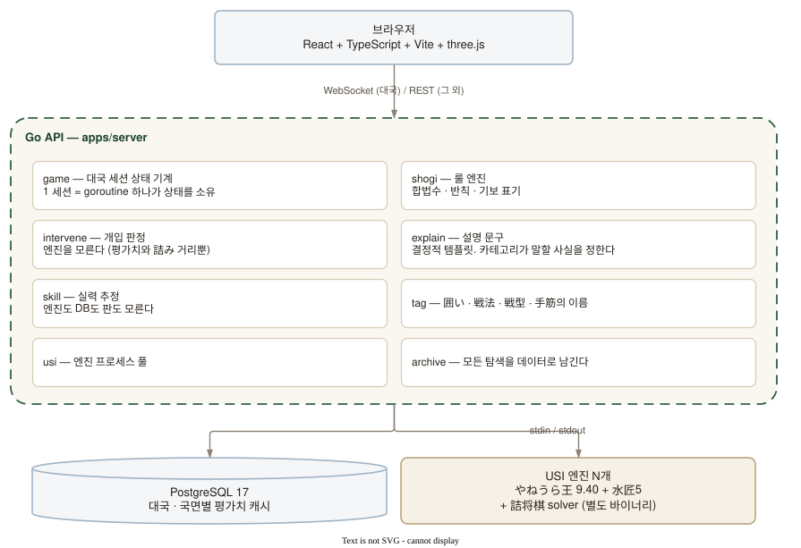
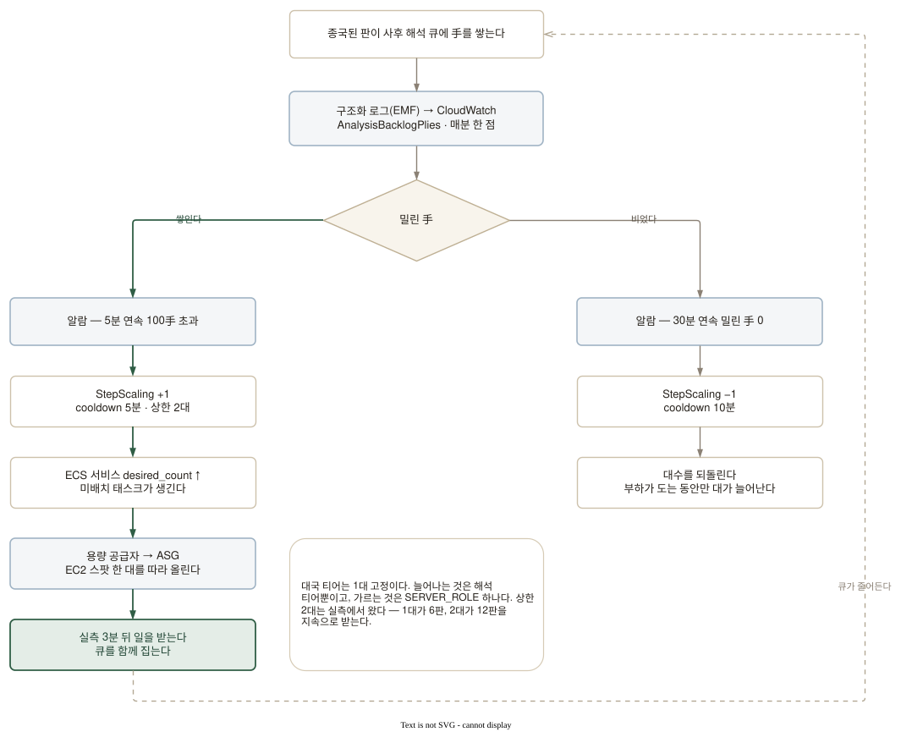

# show-gi — 개입할 때를 스스로 정하는 쇼기 상대

[](https://show-gi.com)

> **AI가 사람의 행동에 개입할 타이밍과 강도를 스스로 정하는 제품.** 검증 도메인은 쇼기(将棋)다.

**https://show-gi.com** — 로그인 없이 바로 한 판 둘 수 있다.

`Go` · `React + TypeScript + Vite + three.js` · `PostgreSQL 17` · `USI 엔진(やねうら王 + 水匠5)` · `AWS ECS on EC2 · Terraform`

설계와 개발 문서는 [docs/](docs/README.md)에 있다. 하나만 읽는다면 [docs/01-core.md](docs/01-core.md).

---

## 1. 무엇을 만들었나

초심자가 **큰 실수를 두는 순간에만** 판을 멈추고, **왜 나쁜지**를 판 위에서 보여준 뒤 다시 두게 한다. 평소에는 최선수를 알려주지 않는다. 상대 AI의 강함은 플레이어가 둔 수를 보고 **한 판 안에서** 움직인다 — 指導対局처럼.

컴퓨터 쇼기는 양극단이다. 약한 설정은 있을 수 없는 자리에 駒를 버리며 자멸하고, 강한 설정은 작은 실수 하나로 국면을 통째로 뒤집는다. **사람이 결국 이기는 데까지 데려가는 상대**가 그 사이에 없다. 그 사이를 채우는 것이 이 제품이다.

悪手를 잡으면 착수를 되돌리고, 무엇이 잡히는지를 판 위의 공격선과 짧은 설명으로 보여준다. 카드에는 되돌리지 않고 그대로 진행했을 때의 상대 응수도 함께 선다. 숫자로 「악수입니다」라고 채점하는 화면이 아니라, **다음에 무슨 일이 벌어지는지를 같은 국면에서 확인하고 다시 두는** 화면이다.

[](https://show-gi.com)

_▲3三角成를 되돌린 순간. 馬가 잡히는 이유와, 그대로 진행했을 때의 응수를 한 화면에서 보여준다._

---

## 2. 유저 워크플로우

들어오는 문이 다섯이고, 어디로 들어와도 **한 판을 되짚는 같은 자리**로 모인다.

<picture>
  <source media="(prefers-color-scheme: dark)" srcset="docs/images/user-flow.dark.svg">
  
</picture>

| 기능              | 내용                                                                                                       |
| ----------------- | ---------------------------------------------------------------------------------------------------------- |
| **대국과 개입**   | 룰 엔진·엔진 판정·일본어 기보. 悪手는 이유를 짚고 다시 둘 수 있다                                          |
| **적응형 상대**   | 둔 수의 질을 보고 강함을 대국 중에 조절한다. 안전하지 않은 후보수는 고르지 않는다                          |
| **힌트와 待った** | 갇혔을 때의 계단식 힌트, 부르는 힌트(판당 6회), 待った(판당 3회)                                           |
| **되짚기와 총평** | 평가치 그래프, 국면에서의 분기, 종국 뒤 총평, 같은 한 판에서 만드는 퀴즈                                   |
| **학습의 실마리** | 詰み 게이지, 囲い·戦法·戦型·手筋 태그, 무너지기 쉬운 곳                                                    |
| **기록과 로그인** | 로그인 없이 대국 가능. 로그인하면 실력의 변화와 중단한 판을 이어받는다                                     |
| **사람끼리 대국** | 초대 링크나 자동 매칭으로 일대일. 정원은 두 명, 한 手 60초. 개입은 나오지 않는다                           |
| **검토**          | 手合割을 골라 初手부터 직접 놓으며 형세와 **최선수 3手**를 확인한다                                        |
| **기보 가져오기** | 다른 데서 둔 자기 기보를 붙이면 여기서 둔 판과 같은 해석·퀴즈·실력 추정을 지난다. KIF·KI2·CSA·USI를 읽는다 |
| **판 사진 읽기**  | 판이 찍힌 사진을 올리면 국면을 읽어 내고, 사람이 확인해 확정한 뒤 검토 화면으로 넘어간다                   |
| **놀이법 안내**   | 개입의 흐름, 悪手의 종류, 힌트 횟수를 대국 전에 확인할 수 있다                                             |

### 한 판을, 두고 끝내지 않는다

되짚기에서는 평가치 그래프가 그대로 국면의 이동 장치가 된다. 빨간 점은 개입이 일어난 자리이고, 고르면 그 시점의 판과 후보수가 열린다. 총평으로 한 판 전체를 읽고, 마음에 걸린 국면에서는 **다른 수를 그 판에서 실제로 둬 보며** 앞을 확인한다.

[](https://show-gi.com)

_평가치의 궤적, 총평, 후보수, 판을 한 화면에 두었다. 그래프 위의 36手째에서 다른 수순을 둬 보고 있다._

### 끝난 한 판이, 그대로 문제가 된다

일반 문제를 푸는 것이 아니라 **방금 자기가 둔 한 판**에서 詰み 1문과 최선수 3문을 만든다. 詰み 문제는 맞힐 때까지 답을 내지 않고, 판 위에서 王手를 이어 간다. 채점할 때마다 엔진을 부르지 않고, 종국 시점에 마련해 둔 정답 수순으로 판정한다.

<p align="center">
  <a href="https://show-gi.com"></a>
</p>

_98手째에 있던 7手詰め. 남은 手数와 「王手가 되는 수만」이라는 조건까지 보여주고, 수순 자체는 감춘다._

### 검토는 답을 보러 오는 화면이다

手合割을 골라 初手부터 양쪽을 직접 놓아 보는 판이다. 형세 한 줄과 **최선수 3手**를 각자의 평가치와 최선 대비 낙폭까지 그대로 내고, 판 위의 초록 화살표가 그 첫 줄이다.

[](https://show-gi.com/explore)

_15手째의 형세 +115. 최선수 세 줄과 그 낙폭(−1 · −148), 그리고 첫 줄인 ▲3四飛가 판 위의 화살표다._

---

## 3. 개입 판정 — 판단도 설명도 결정적이다

悪手인지, 어느 카테고리인지, 무엇이 잡히는지는 **결정적 룰과 엔진 평가치**가 정한다. 화면에 나가는 일본어도 그 사실에서 코드가 조립하므로, 같은 사실에는 항상 같은 문장이 나간다. 카테고리마다 말해도 되는 사실이 정해져 있어(`explain.Facts`) 거기 없는 것은 문장에 나타날 수 없다.

<picture>
  <source media="(prefers-color-scheme: dark)" srcset="docs/images/intervention-loop.dark.svg">
  
</picture>

판정은 평가치를 그대로 쓰지 않고 **승률로 옮긴 뒤 낙폭**을 본다. 같은 cp 차이가 항상 같은 무게는 아니다 — 호각인 국면의 300cp와 이미 크게 벌어진 국면의 300cp는 이길 가망의 변화가 전혀 다르다.

$$WR(cp) = \frac{1}{1 + e^{-cp/K}}, \qquad \Delta = WR(\text{최선수 뒤}) - WR(\text{실제로 둔 수 뒤})$$

종반에서는 이 식이 포화한다(+2000cp에서 詰み까지 Δ 3.5%p). 그래서 기준을 **詰み까지의 거리**로 바꾼다 — 詰将棋 solver가 詰み을 찾은 순간부터가 이 제품의 종반이고, 5手 이하의 詰み을 놓치는 수만 멈춘다. 11手詰め를 못 본 것은 8급에게 실수가 아니다.

**탐색은 깊이로 건다. 시간으로 자르지 않는다.** 같은 국면을 항상 같은 기준으로 판정하려면 탐색이 깊이로 고정되어야 하고, 그래서 서버가 붐벼도 悪手 판정과 상대의 강함이 그대로다. 지연은 캐시와 선행 계산으로 잡는다.

### 최선수를 알려주지 않는다

수를 대신 놓아주는 순간 사람은 생각을 멈춘다. 그래서 각 표시가 어디까지 말할지를 못 박아 두었다.

- 제지형(悪手 뒤) — 「왜 나쁜가」까지
- 詰み 게이지 — 수순도 手数도 내지 않는다. 판의 테두리가 타오를 뿐
- 둔 뒤에 붙는 이름(囲い·戦法·戦型) — 「지금 이렇게 되어 있다」까지

수를 짚어주는 힌트는 둘이고, **둘 다 기댈 수 없다는 것이 조건**이다.

- **갇힘 힌트** — 같은 국면에서 3회 되물리면 그 駒에, 5회에 手에 표시가 붙는다. 다섯 번 실패해야 열리는 문이다
- **부르는 힌트** — 버튼으로 부른다. 같은 국면에서 1회째는 그 駒, 2회째는 그 手, 3회째는 없다. **판당 6회**라 답까지 볼 수 있는 것은 최대 3手다

힌트를 부른 국면의 手는 **실력 추정에서 뺀다.** 알려준 수를 그대로 둔 것이 실력으로 남으면 화면의 段級이 부풀기 때문이다.

---

## 4. LLM이 도는 자리는 둘이고, 둘 다 「받아 적는 일」이다

판을 통째로 생성 모델에 던지고 「이 수 어때?」를 묻는 경로는 이 레포에 없다. 학습 앱에서 설명이 틀리면 초심자에게는 검증할 수단이 없기 때문에, **판단과 표현은 전부 결정적 코드가 맡는다.** 생성 모델은 **가져온 기보의 서식을 옮겨 적는 자리**와 **판이 찍힌 사진을 읽는 자리**에만 있다.

<picture>
  <source media="(prefers-color-scheme: dark)" srcset="docs/images/llm-pipeline.dark.svg">
  
</picture>

**경계는 「좌표를 안 시킨다」다.** 프롬프트가 筋도 段도 「5五」도 한 번 쓰지 않는다. 사진 쪽이 듣는 말은 「위 줄부터, 왼쪽부터, 그려진 대로」 하나이고, **그 순서가 SFEN 판 칸의 순서와 그대로 같아서 옮기는 코드에 좌표 계산이 없다.** 先手·後手도 시키지 않는다 — 사진에서 알 수 있는 것은 「위쪽 편인가 아래쪽 편인가」뿐이고, 아래쪽을 先手로 두는 것은 코드가 정한다.

**검증자가 계층마다 다르다.** 기보 쪽은 옮겨 적은 표기가 한 手씩 룰 엔진을 통과해야 수가 되므로 출력에 믿는 부분이 없다. 사진 쪽은 재생할 수순이 없어 국면 자체를 검사하고(二歩·玉의 수·行き所のない駒·王手放置), 그다음에 **사람이 확인 화면에서 판을 확정한다.**

**결정적 파서가 하나라도 성공하면 이 계층은 아예 부르지 않는다.** 같은 기보가 언제나 같은 결과를 주는 것이 기본값이고, 정규화는 그 기본값이 성립하지 않는 자리에서만 돈다.

### 붙여 넣은 기보는 파서가 먼저 읽는다

KIF·KI2·CSA·USI는 결정적 파서가 그대로 읽고, 읽힌 手는 한 手씩 룰 엔진을 지난다. 화면은 手数·양쪽 이름·결과와 수순 앞뒤를 먼저 보여주고, **어느 편이었는지만 사람에게 묻는다** — 그 답이 있어야 段級을 어느 쪽으로 셀지가 정해진다.

[](https://show-gi.com)

_KIF 한 벌을 붙여 넣은 직후. 15手·先手の勝ち까지 파서가 읽었고, LLM은 한 번도 불리지 않았다._

### 사진에서 읽어 낸 판은 사람이 확정한다

올린 사진과 읽어 낸 판을 나란히 두고, 칸을 눌러 駒를 고치고 持ち駒를 세어 맞춘다. 확정하기 전에 룰 엔진이 국면을 검사하므로 **성립하지 않는 판은 해석으로 넘어가지 않는다.**

[](https://show-gi.com)

_왼쪽이 올린 사진, 오른쪽이 읽어 낸 판이다. 龍(成駒)과 양쪽 持ち駒까지 이 화면에서 확정한 뒤 검토로 넘어간다._

---

## 5. 아키텍처

<picture>
  <source media="(prefers-color-scheme: dark)" srcset="docs/images/architecture.dark.svg">
  
</picture>

| 구분   | 내용                                                                                        |
| ------ | ------------------------------------------------------------------------------------------- |
| 서버   | Go 단일 서비스. 대국 상태는 세션마다 직렬로 관리하고, 탐색만 병행 실행한다                  |
| 엔진   | やねうら王 9.40 + 水匠5. 詰み 탐색에는 전용 solver를 쓴다                                   |
| 프론트 | React + TypeScript + Vite + three.js. 합법수 판정은 전부 서버 쪽                            |
| DB     | PostgreSQL 17. 대국과 해석(국면별 평가치 캐시)을 저장                                       |
| 인프라 | AWS ECS on EC2 스팟(c6g.large / ARM64) + ALB + RDS + Route53. Terraform, GitHub OIDC로 배포 |

**대국 상태는 세션 goroutine 하나가 소유한다.** 롤백이 있는 이상 상태 변경 순서가 곧 제품 정합성이라, HTTP 핸들러는 상태를 직접 읽지 않는다. 다시 두는 중에 낡아진 해석 결과는 버려서 판과 설명이 어긋나지 않게 한다.

**패키지마다 모르는 것이 정해져 있다.** 개입 판정(`intervene`)의 입력은 이미 구해진 평가치와 詰み 거리뿐이라 상수를 흔들어 보는 데 엔진이 필요 없고, 실력 추정(`skill`)은 엔진도 DB도 판도 모른다.

**모든 탐색은 데이터로 남는다.** `archive`가 국면과 깊이별 값을 표에 쌓고, 상대 수·개입 판정·가정 수순·검토·부르는 힌트·되짚기 퀴즈 **여섯 자리가 전부 그 한 겹을 지난다.** 같은 국면을 다시 물으면 1.54s가 27ms로 떨어지고(로컬 실측), 詰み 캐시는 프로덕션에서 여덟 판을 동시에 받을 때 90.8%가 맞는다.

---

## 6. 오토 스케일링

대국은 사람을 기다리게 하지 않아야 하고, 종국 뒤의 해석은 늦어도 된다. 그래서 **EC2 티어가 둘이고, 가르는 것은 `SERVER_ROLE` 하나다.** 늘어나는 것은 해석 티어뿐이다.

<picture>
  <source media="(prefers-color-scheme: dark)" srcset="docs/images/autoscaling.dark.svg">
  
</picture>

신호는 **밀린 手**(`AnalysisBacklogPlies`) 하나다. 구조화 로그(EMF)가 매분 한 점을 CloudWatch에 세우고, 알람이 ECS 서비스의 대수를 계단식(StepScaling)으로 움직인다. 목표 추적을 쓰지 않는 것은 이 층의 임계치가 부하 회차의 실측으로 이미 잡혀 있기 때문이다 — 밀린 手는 대수에 반비례하지 않아서 「용량 한 단위당 부하」 꼴이 아니다.

용량 공급자가 미배치 태스크를 보고 EC2를 따라 올리며, 새 대가 일을 받기까지 **실측 3분**이다. 되돌리는 쪽의 신호는 임계 100의 반대쪽이 아니라 **「30분 내내 비어 있다」**다 — 밀린 手는 포화 신호라서, 여유가 있는 상태와 일이 없는 상태를 가르는 것이 연속 30분이다.

---

## 7. 개발

```sh
pnpm install
docker compose up -d          # api + db
pnpm dev                      # http://localhost:5173
```

```sh
# 검증
pnpm lint && pnpm typecheck && pnpm test && pnpm build
cd apps/server && gofmt -l . && go vet ./... && go test -race ./...
terraform -chdir=infra fmt -check && terraform -chdir=infra validate
```

`-race`를 빼지 않는다. 엔진 프로세스와 세션 goroutine이 동시에 도는 구조라 데이터 경합이 가장 값비싼 버그이고, 그것만 도구가 사람보다 확실히 잘 잡는다.

자세한 구성은 [apps/server/README.md](apps/server/README.md)와 [apps/web/README.md](apps/web/README.md)에, 배포 절차는 [deploy/README.md](deploy/README.md)에 있다.

## 8. 라이선스

본체는 [MIT](LICENSE).

쇼기 엔진(やねうら王·水匠5의 NNUE 평가 함수)은 **GPLv3**이고, 이미지 안에서 소스로부터 빌드한다. 엔진은 파이프 건너편의 별도 프로세스라 GPL이 우리 코드로 전파되지 않지만, 이미지에 바이너리를 담는 것은 배포에 해당하므로 어느 태그를 빌드했는지를 Dockerfile에 남겨 둔다.
