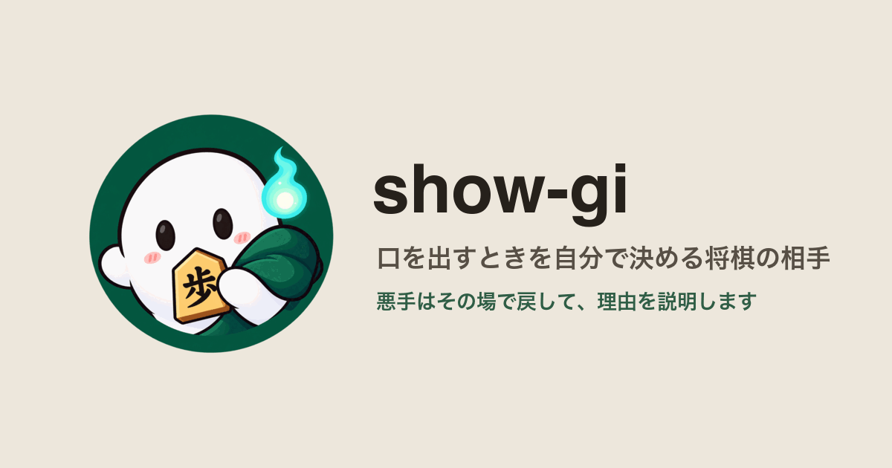
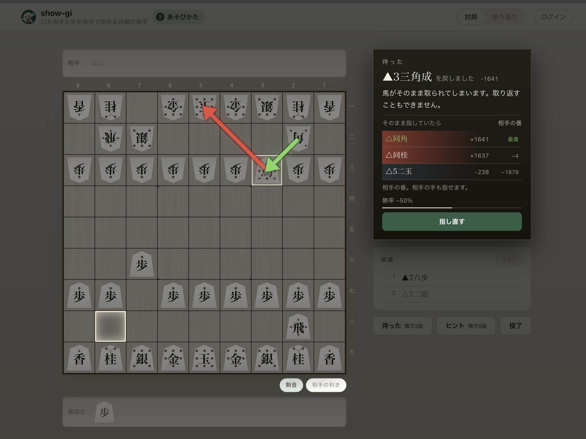
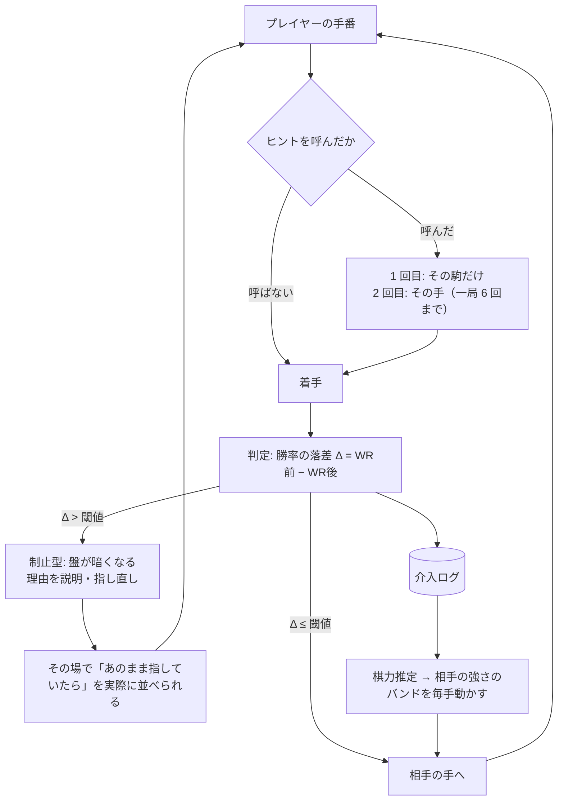
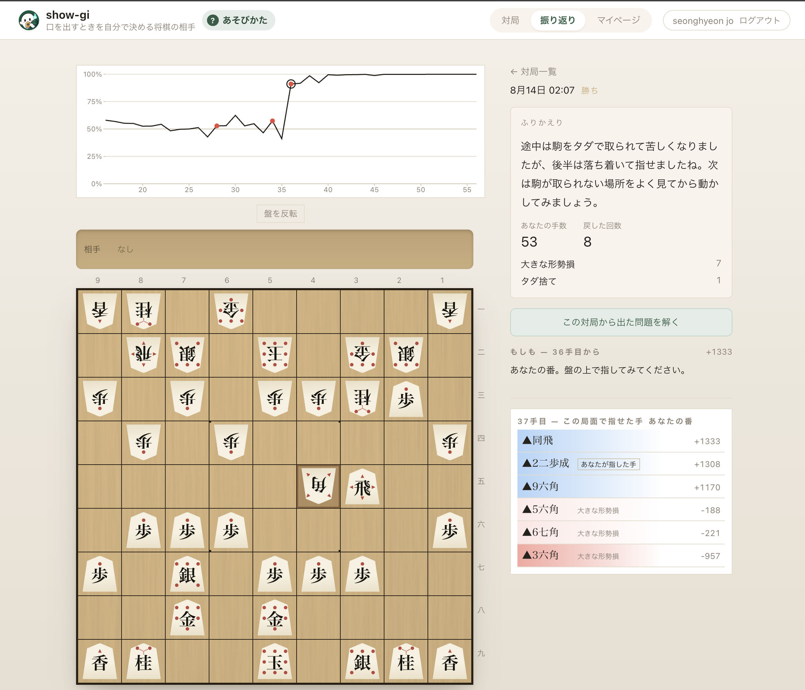
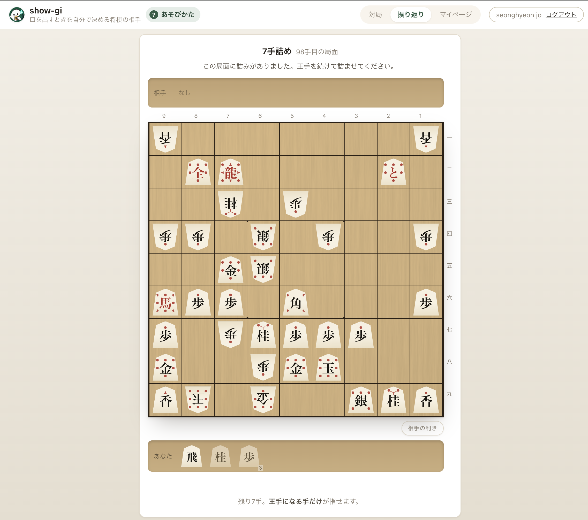
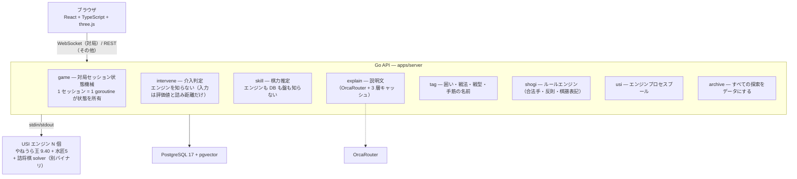

# show-gi — AI が「いつ口を出すか」を自分で決める

[](https://show-gi.com)

> **AI が人の行動に介入するタイミングと強度を、自分で調整するプロダクト。** 検証ドメインは将棋（しょうぎ）です。

**https://show-gi.com** — ログインなしでそのまま一局指せます。

[aihackathon.jp](https://aihackathon.jp/) 提出作品。開発ドキュメント（韓国語）は [docs/](docs/README.md) にあります。

---

## 1. 何をするものか

初心者が**大きなミスを指した瞬間だけ**盤が止まり、**なぜ悪いのか**を説明して指し直させます。普段は最善手を見せません。そして相手 AI の強さは、あなたが指した手を見て**一局のうちに**動きます — 師匠の指導対局のように。

[](https://show-gi.com)

_悪手を検知した瞬間。盤上の攻撃線と説明を見て、その場で指し直せます。_

コンピュータ将棋は今も両極端です。弱い設定は駒をあり得ない場所に捨てて自滅し、強い設定はこちらの小さなミス一つで局面がまるごとひっくり返る。**「人が最終的に勝てるところまで連れていく」相手**が、間に一つもありません。

|                      | 普通の将棋アプリ           | show-gi                                        |
| -------------------- | -------------------------- | ---------------------------------------------- |
| 悪手を指したとき     | そのまま進む               | **その場で止めて、理由を言って、指し直させる** |
| 最善手               | ヒントボタンでいつでも     | **呼べば出る。ただし一局 6 回まで**            |
| 相手の強さ           | 対局前に選ぶ数字           | **一局の中で、あなたの手を見て動く**           |
| 解説を書いているのは | LLM が盤面を読んで判断する | **エンジンが判断し、LLM は言い方だけ担当する** |

---

## 2. 設計原則は三つだけ

### ① 判定はエンジン、表現だけ LLM

悪手かどうか、どのカテゴリか、何が取られるのか — **決定的なルールとエンジンの評価値**が決めます。LLM がやるのは、そうして出てきた構造化データを日本語の文にすることだけです。

学習アプリで説明が間違っていると、初心者にはそれを検証する手段がありません。**間違ったことをそのまま覚えます。** だから「この局面どう思う?」と盤ごとプロンプトに投げる経路は、このリポジトリに一本もありません。

LLM の出力も信用しません。空文・120字超・**捏造した升や手**・`max_tokens` で切れた応答は捨て、決定的な日本語テンプレートに落とします。そのテンプレートも事実（利きの枚数・取られる駒）を含むので、**ルータが落ちても製品はそのまま立ちます。**

### ② 最善手は教えない

手を指してあげた瞬間、人は考えるのをやめます。

- 制止型（悪手のあと）— 「なぜ悪いか」まで
- 詰みゲージ — 手順も手数も出さない。盤の縁が燃えるだけ
- 指したあとの名前（囲い・戦法・戦型）— 「今こうなっている」まで

手を指すヒントは二つあり、**どちらも「頼れない」ことが条件**です。

- **行き詰まりヒント** — 同じ局面で 3 回戻されたらその駒に、5 回で手に印がつきます。5 回失敗しないと開かない扉です
- **呼ぶヒント** — ボタンで呼びます。同じ局面で 1 回目はその駒、2 回目でその手、3 回目はありません。**一局 6 回**なので、答えまで見られるのは最大 3 手です

呼んだ局面の手は**棋力推定から外します**。教えた手をそのまま指したことが実力として記録されると、画面に出る段級が膨らむからです。

> **提案型ヒント（着手の前に「ここに何かある」）は今は切っています。** 人が指した 3 局で一度も出ず、原因が探索の深さでも遅さでもなく**ゲートの幅**だと実測で分かったためです（候補 64 手のうち、最善から 100cp 以内が 0 手）。緩めれば「最善より 3 歩悪い手」に手筋の名前が付くので、緩めずに切りました。

### ③ 探索は必ず深さで打つ。時間で切らない

`go movetime` を使うと同じ局面が同じ答えを返さなくなり、それ一つが三つを同時に壊します — 局面キャッシュが「同じ局面 = 同じ結果」を前提にできず、候補手の評価値が負荷で揺れてバンド制御が成立せず、相手の強さがサーバの都合で変わる。

途中で打ち切るのも同じ理由で禁止です。**打ち切った結果は depth N の結果ではない**ので、`computed_depth = N` としてキャッシュに書くと嘘になり、その上で介入判定が回ります。だから `usi` パッケージには時間ベースの探索 API が**最初から存在しません** — 消しておくほうがコメントより確実です。

遅延はキャッシュ・深さ（14→12）で吸収します。人を待たせてよい、というのがこの製品の判断です。将棋の相手が数秒考えるのは自然だからです。

---

## 3. 介入ループ



判定式は評価値をそのまま使わず、**勝率に変換してから落差**を見ます。cp は優勢な区間で意味が圧縮され、−800 が局面ごとに違う意味になるからです。

$$WR(cp) = \frac{1}{1 + e^{-cp/K}}, \qquad \Delta = WR(\text{最善手後}) - WR(\text{実際の手の後})$$

終盤ではこの式が飽和します（+2000cp から詰みまで Δ 3.5%p）。なので**詰みの距離**に基準を切り替えます — 詰将棋 solver が詰みを見つけた瞬間からがこの製品の「終盤」で、5 手以下の詰みを逃す手だけを止めます。11 手詰めを見逃したのは 8 級にとってミスではないからです。

---

## 4. いま実際に動いているもの

|                                    |                                                                                                                                       |
| ---------------------------------- | ------------------------------------------------------------------------------------------------------------------------------------- |
| **対局ループ**                     | WebSocket 一本が一局。ルールエンジン・USI エンジンブリッジ・棋譜の日本語表記                                                          |
| **介入判定と指し直し**             | レベル別の勝率落差閾値。悪手カテゴリ **9 種 + `other`**、判定は順序つき（順序そのものがルール）                                       |
| **待った**                         | 一局 3 回まで。自分の手と相手の応手の 2 手を巻き戻す。中断した局を再開しても予算を引き継ぐ                                            |
| **適応型の相手**                   | MultiPV k=10 の候補から選ぶ。**自殺手フィルタが先に効く**ので「投げて負ける」ことがない。バンド `[+100, +300]` は**譲る幅**として読む |
| **リアルタイム棋力推定**           | 判定の落差を毎手積んでバンドを動かす。対局中は `相手の強さ` の目盛りだけ、自分の段級は終局後の総評が一度だけ言う                      |
| **詰みゲージ**                     | 盤の縁に紫の炎。**相手玉までの距離だけ**を描く。手順も手数も出さない                                                                  |
| **囲い・戦法・戦型・手筋のタグ**   | 座標集合とルールエンジンで名前を付ける。手筋は**エンジンのゲートを通ったものだけ**に名前が付く                                        |
| **LLM 説明層**                     | OrcaRouter・`temperature=0`・3 層キャッシュ・決定的フォールバック                                                                     |
| **終局後の総評**                   | 数えるのは記録、文を書くのが LLM。プロンプトに数字を渡さず等級（`一度だけ`・`数回`・`何度も`）だけ渡す                                |
| **振り返り画面**                   | 評価値の軌跡グラフが移動装置。最善手・実際に指した手・戻された手・自分で待ったした手が一つのリストに並ぶ                              |
| **「そのとき、こう指していたら」** | どの局面からでも実際に並べられる。分岐は保存しないが、そこで走った解析は全部残る                                                      |
| **振り返りクイズ**                 | 詰み 1 問と「最善手は?」3 問を、**終わったその一局から**作る。採点にエンジンを使わない                                                |
| **マイページ**                     | 段級・戦績・崩れやすいところ                                                                                                          |
| **あそびかた（`/guide`）**         | 口出しの流れと 10 種類、呼べるものの予算を対局前に読める。**画面キャプチャではなく実物のコンポーネント**で描くので画面と一緒に変わる  |
| **Google ログイン**                | **任意です。** 押さなければ匿名のまま最後まで指せる。変わるのはその一局が誰のものとして残るかだけ                                     |
| **盤面描画**                       | three.js の正射影カメラ（遠近法は使わない）。利きの影を一枚重ねる                                                                     |

[](https://show-gi.com)

_終局後の振り返り。評価値の軌跡から局面を選び、別の手をその盤で実際に指せます。_

<p align="center">
  <a href="https://show-gi.com"></a>
</p>

_終わった一局から作られた詰みクイズ。答えを直接見せず、王手を続けて解きます。_

盤は 3D ですが**遠近法ではありません**。将棋の駒は全部同じ五角形で、漢字だけで区別し、向きで先後を表します。遠近投影を入れた瞬間に奥の漢字が潰れ、相手の駒は裏返しに縦に潰れ、手前が奥を隠す。**学習アプリで判読の負荷を上げると、アプリが自分の目的と戦うことになります。**

---

## 5. 技術構成



|          |                                                                                                                                                                     |
| -------- | ------------------------------------------------------------------------------------------------------------------------------------------------------------------- |
| サーバ   | **Go 単一サービス。** USI エンジンは stdin/stdout の子プロセスで、監視・再起動・タイムアウト・同時探索が全部並行処理になる。この製品はエンジンを 3 つ以上同時に回す |
| エンジン | **やねうら王 9.40 + 水匠5**（`FV_SCALE=24`）。イメージ内でソースからビルド                                                                                          |
| 詰み探索 | **別バイナリ。** 探索部に `go mate` を送ると**エラーも出さずに** `bestmove` が返る。詰将棋 solver エディションだけが規格どおり `checkmate` を返す                   |
| フロント | React + TypeScript + Vite + three.js。**クライアントはルールを一つも知らない** — 二歩も打ち歩詰めも知らず、サーバがくれた合法手だけを信じる                         |
| DB       | **PostgreSQL 単一。グラフ DB を使わない** — 必要なクエリが 1-hop と「根から N 手再生」だけで、可変長パス探索がない。隣接リスト 2 テーブルで足りる                   |
| LLM      | OrcaRouter（OpenAI 互換 HTTP）。`temperature=0`                                                                                                                     |
| インフラ | AWS ECS Fargate (ARM64) + ALB + RDS + Route53、Terraform、GitHub OIDC でキーレスデプロイ                                                                            |

**状態はセッション goroutine 一つが所有します。** 指し直しがある以上、状態変更の**順序**がそのまま製品の整合性なので、mutex でごまかしません。遅い仕事だけが外に出て、全部が探索世代を持って出ていき、**戻ってきたとき世代が違えば捨てられます。**

---

## 6. ハッカソン審査基準への回答

| #   | 項目             | 答え                                                                                                                                                                                  |
| --- | ---------------- | ------------------------------------------------------------------------------------------------------------------------------------------------------------------------------------- |
| 1   | 課題の実在性     | 機能を分解すると各ピースは既にある。**「指しているときに介入する」だけが空いている**                                                                                                  |
| 2   | ビジネス成立性   | 市場縮小は認める。代わりに**支払意思は既に証明済み** — 将棋ウォーズ累計 800 万ユーザ / 10 億局、棋神ラーニング月 1,200 円、棋神アナリティクス ライト月 1,100 円が実際に売れている     |
| 3   | 完成度           | 本番で介入ループが最後まで回る。人が実際に一局指し切っている（105 手・勝ち）                                                                                                          |
| 4   | AI である必然性  | 判定層はエンジン必須（ルールでは悪手判定が不可能）。表現層は**「文を生成する」ではなく「ユーザモデルに条件づけられた説明」** — 同じ悪手でも 10 級と初段に言うべきことが違う           |
| 5   | 技術的な作り込み | 介入エンジン・深さ別評価キャッシュ・リアルタイム棋力推定・エンジンゲート付きタグ判定                                                                                                  |
| 6   | LLM コスト       | **削減が 2 段**。構造的に呼び出し自体を減らし（3 層キャッシュ・判定を通った手には呼ばない・Tier 1 は事前生成済み）、残ったものだけを最適モデルにルーティングする                      |
| 7   | セキュリティ     | ドメイン固有の実在する脅威 2 種 — ①誤用すると不正行為ツールになる（→ AI 練習対局限定。外部対局画面へのオーバーレイが構造的に不可能）②棋力プロファイルは機微情報（→ 本人しか読めない） |
| 8   | 次世代性・独創性 | **介入タイミング制御はドメイン非依存の問題です。** 将棋は最初の市場で、「正解が客観的に存在する学習領域」ならどこにでも当てはまります                                                 |

---

## 7. まだ言えないこと

**書けば嘘になることを、ここに先に書いておきます。**

- **LLM の 1 回あたりのコストを出せません。** ホスティング版のルータが `usage.cost_usd` も総額 API も返さないので、`interventions.cost_yen` は常に 0 です。トークン数と価格表から推定して埋めることはしません — その瞬間、発表の数字が我々の作った数字になります。言えるのは**「いくら節約したか」ではなく「呼び出しをどれだけ減らしたか」**までです
- **定数はほぼ全部が初期値です。** 勝率変換の K（600）、レベル別閾値、相手のバンド、棋力推定の 5 定数、行き詰まりヒントの 3 と 5。記録から再採点する仕組みは作りましたが、**一つも動かせませんでした** — 標本がほとんどエージェントの対局で、人間の基準で決めるものが無かったからです
- **先読み（事前計算）はまだありません。** キャッシュはあり、同じ局面が 1.54s → 27ms になりますが、**それはローカルの数字**です
- **カテゴリはオントロジーの全部ではありません。** 二枚換えの損（複数手にまたがる交換を見る必要がある）と定跡外れ（定跡ブックが要る）は入っていません
- **手筋の名前の精度はまだ本番水準ではありません。** 実戦棋譜 1 局で 8 件中 3 件が誤判定でした（修正済みですが、標本が 1 局です）。「良い手に間違った名前を付ける」のが学習アプリで最も高くつく失敗です。だから**提案型ヒントは名前を広げるのではなく切りました**（上）。指したあとに名前が付く方（囲い・戦法・戦型）はそのまま動いています
- **3D は 1.5 カットです。** 盤面と利きの影は入りましたが、**利きの影は既定でオフ**（盤の下のトグルで点ける）で、振り返り中に一つの升へ溜まるカット 2 は**自動では点きません** — 退色した盤の上で「相手が手を伸ばした升」ではなく盤の傷に見えたからです。「3D 将棋盤」と書けば嘘になります。3D の予算は**利きの影一枚**に全部入っています
- **提案型ヒントは一度も出ないまま切りました。** 人が指した 3 局で 0 件です。原因は k でも遅さでもなく**ゲートの幅**でした — 3 局目の棋譜を k=3 と k=6 で測り直しても、候補 64 手のうち通過は**どちらも 0** です。緩めれば名前の精度（上）がそのまま嘘になるので、緩めずに切って**呼ぶヒント**に置き換えました
- **呼ぶヒントの 6 回・2 段階も、まだ人が使うのを見ていません。** 数字は決めましたが実測ではありません
- **接続が切れても対局が続くわけではありません。** セッションはメモリにあり接続に紐づいています。中断した局を**あとから再開できる**だけで、それもログインした人だけです
- **ダークモードはありません。** 暗いのは画面ではなく**盤のある部屋**で、それは介入がかかるときに作られます

---

## 8. 開発

```sh
pnpm install
docker compose up -d          # api + db
pnpm dev                      # http://localhost:5173
```

**エンジンが arm64 Debian バイナリなので macOS では直接動きません。** api は必ずコンテナで動かします。

```sh
# 検証
pnpm lint && pnpm typecheck && pnpm test && pnpm build
cd apps/server && gofmt -l . && go vet ./... && go test -race ./...
terraform -chdir=infra fmt -check && terraform -chdir=infra validate
```

> `go test` だけでは全部は回りません。DB・エンジンのテストは環境変数が無いと**静かに skip され、緑に見えます。** 何が要るかは [apps/server/README.md](apps/server/README.md) に表であります。

詳しい構成は [apps/server/README.md](apps/server/README.md) と [apps/web/README.md](apps/web/README.md)、デプロイ手順は [deploy/README.md](deploy/README.md) にあります。

## 9. ライセンス

本体は [MIT](LICENSE)。

将棋エンジン（やねうら王・水匠5 の NNUE 評価関数）は **GPLv3** で、イメージ内でソースからビルドしています。エンジンはパイプの向こう側の別プロセスなので GPL は我々のコードに伝播しませんが、イメージにバイナリを含めることは配布にあたるため、どのタグをビルドしたかを Dockerfile に残しています。

`kb_chunks` の知識コーパスは項目ごとに `source_url` と `source_license` を持ち、**出典の無い chunk はプロンプトに付きません。** 未検証の知識が静かに説明に漏れる経路を、コードではなくスキーマで塞いでいます。
