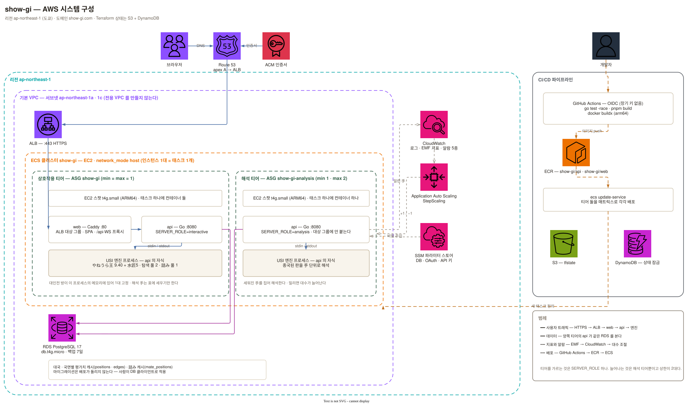
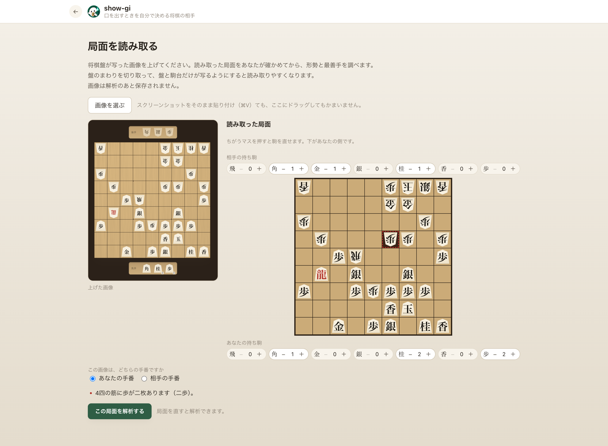

# show-gi — 개입할 때를 스스로 정하는 쇼기 상대

[](https://show-gi.com)

> AI가 언제, 얼마나 사람의 행동에 개입할지 스스로 정하는 제품. 쇼기(将棋)로 이 방식을 검증한다.

**https://show-gi.com** — 로그인 없이 바로 한 판.

`Go` · `React + TypeScript + Vite + three.js` · `PostgreSQL 17` · `USI 엔진(やねうら王 + 水匠5)` · `AWS ECS on EC2 · Terraform`

설계와 개발 문서는 [docs/](docs/README.md). 하나만 읽는다면 [docs/01-core.md](docs/01-core.md).

---

## 1. 프로젝트 목표

초심자가 큰 실수를 두는 순간에만 판을 멈추고, 왜 나쁜 수인지 판 위에서 보여준 뒤 다시 두게 한다. 평소에는 최선수를 알려주지 않는다. 상대 AI는 플레이어가 둔 수를 보고 대국 중에 강함을 조절한다. 指導対局에 가까운 쇼기 상대를 목표로 한다.

기존 컴퓨터 쇼기에서 해결하려는 문제는 다음과 같다.

- 약한 설정에서는 있을 수 없는 자리에 駒를 버리며 자멸한다.
- 강한 설정에서는 작은 실수 하나로 국면 전체가 뒤집힌다.
- 그 사이에서 사람이 이길 수 있도록 가르치는 상대가 없다.

### 핵심 기능 — 悪手 개입

悪手를 감지하면 착수를 되돌리고, 무엇이 잡히는지 공격선과 짧은 설명으로 보여준다. 카드에는 그대로 진행했을 때의 상대 응수도 표시한다. 플레이어는 점수를 받는 대신 같은 국면에서 다음 수순을 확인하고 다시 둔다.

[](https://show-gi.com)

_▲3三角成를 되돌린 순간. 馬가 잡히는 이유와, 그대로 진행했을 때의 응수를 한 화면에._

---

## 2. 아키텍처

도쿄 리전 한 곳에서 운영한다. ALB 뒤에 ECS on EC2 스팟을 두고 두 티어로 나눠 실행한다. 엔진은 api 컨테이너의 자식 프로세스다.

<picture>
  <source media="(prefers-color-scheme: dark)" srcset="docs/images/aws-architecture.dark.svg">
  
</picture>

| 구분   | 내용                                                                                      |
| ------ | ----------------------------------------------------------------------------------------- |
| 서버   | Go 단일 서비스. 대국 상태는 세션마다 직렬, 탐색만 병행                                    |
| 엔진   | やねうら王 9.40 + 水匠5. 詰み 탐색은 전용 solver                                          |
| 프론트 | React + TypeScript + Vite + three.js. 합법수 판정은 전부 서버                             |
| DB     | PostgreSQL 17. 대국과 해석(국면별 평가치 캐시)                                            |
| 인프라 | AWS ECS on EC2 스팟(c6g.large / ARM64) + ALB + RDS + Route53. Terraform, GitHub OIDC 배포 |

### 서버 내부 — 여덟 패키지

Go 한 프로세스 안에서 역할을 나눈다. 합법수 판정도 개입 판정도 서버 쪽이고, 브라우저는 그리는 일만 한다.

<picture>
  <source media="(prefers-color-scheme: dark)" srcset="docs/images/architecture.dark.svg">
  
</picture>

서버는 다음 규약을 따른다.

- **대국 상태는 세션 goroutine 하나가 소유한다.** 롤백을 포함한 상태 변경 순서를 보장하기 위해 HTTP 핸들러는 상태를 직접 읽지 않는다. 다시 두는 중에 현재 상태와 어긋난 해석 결과는 폐기한다.
- **패키지별 의존성을 제한한다.** 개입 판정(`intervene`)은 평가치와 詰み 거리만 입력받으므로 엔진 없이 상수를 조정할 수 있다. 실력 추정(`skill`)은 엔진·DB·판에 의존하지 않는다.
- **모든 탐색 결과를 저장한다.** `archive`가 국면과 깊이별 값을 적재한다. 여섯 기능(상대 수 · 개입 판정 · 가정 수순 · 검토 · 부르는 힌트 · 되짚기 퀴즈)의 탐색은 모두 이 계층을 거친다. 같은 국면의 재질의 시간은 로컬 실측에서 1.54s → 27ms로 줄었다. 詰み 캐시 적중률은 프로덕션 8판 동시 실행에서 90.8%였다.

### 해석 티어의 오토 스케일링

대국 중의 대기는 플레이에 영향을 주지만 종국 뒤 해석은 늦어도 된다. 두 작업을 EC2 티어로 분리하고 `SERVER_ROLE`로 구분한다. 오토 스케일링은 해석 티어에만 적용한다.

<picture>
  <source media="(prefers-color-scheme: dark)" srcset="docs/images/autoscaling.dark.svg">
  
</picture>

| 구분             | 내용                                                                  |
| ---------------- | --------------------------------------------------------------------- |
| 신호             | 대기 중인 手 수 `AnalysisBacklogPlies`. EMF 로그에 매분 기록          |
| 스케일 아웃      | 5분 연속 100手 초과 → StepScaling +1. cooldown 5분, 상한 2대          |
| 스케일 인        | 30분 연속 0 → −1. cooldown 10분                                       |
| 새 인스턴스 준비 | 용량 공급자가 미배치 태스크를 보고 EC2 기동. 작업을 받기까지 실측 3분 |

목표 추적 대신 StepScaling을 쓴다. 부하 시험으로 임계치를 정했고, 대기 중인 手 수가 인스턴스 수에 반비례하지 않아 용량 한 단위당 부하로 사용할 수 없기 때문이다.

스케일 인은 대기 중인 手 수가 100 미만일 때가 아니라, 30분 내내 대기 작업이 없을 때 실행한다. 대기 중인 手 수는 포화 여부를 나타낸다. 일시적으로 여유가 생긴 상태와 처리할 일이 없는 상태는 지속 시간으로 구분한다.

---

## 3. 유저 워크플로우

다섯 진입 경로는 모두 대국을 되짚는 기능으로 이어진다.

<picture>
  <source media="(prefers-color-scheme: dark)" srcset="docs/images/user-flow.dark.svg">
  
</picture>

| 기능          | 내용                                                                  |
| ------------- | --------------------------------------------------------------------- |
| 대국과 개입   | 룰 엔진 · 엔진 판정 · 일본어 기보. 悪手는 이유를 짚고 다시 두기       |
| 적응형 상대   | 둔 수의 질로 강함을 대국 중 조절. 안전하지 않은 후보수는 제외         |
| 힌트와 待った | 갇힘 힌트(계단식), 부르는 힌트(판당 6회), 待った(판당 3회)            |
| 되짚기와 총평 | 평가치 그래프, 국면에서의 분기, 종국 뒤 총평, 같은 판에서 만드는 퀴즈 |
| 학습의 실마리 | 詰み 게이지, 囲い·戦法·戦型·手筋 태그, 무너지기 쉬운 곳               |
| 기록과 로그인 | 로그인 없이 대국. 로그인하면 실력의 변화와 중단한 판 이어받기         |
| 사람끼리 대국 | 초대 링크 · 자동 매칭. 정원 2명, 한 手 60초. 개입 없음                |
| 검토          | 手合割을 골라 初手부터 직접 놓기. 형세와 최선수 3手                   |
| 기보 가져오기 | KIF · KI2 · CSA · USI. 여기서 둔 판과 같은 해석 · 퀴즈 · 실력 추정    |
| 판 사진 읽기  | 사진에서 국면 읽기 → 사람이 확정 → 검토                               |
| 놀이법 안내   | 개입의 흐름, 悪手의 종류, 힌트 횟수                                   |

### 평가치 그래프로 대국 되짚기

평가치 그래프를 누르면 해당 국면으로 이동한다. 빨간 점은 개입이 일어난 시점이며, 선택하면 당시의 판과 후보수를 볼 수 있다. 파란 점은 차선수보다 크게 나은 유일한 최선수를 둔 好手다. 총평으로 대국 전체를 살펴보고, 궁금한 국면에서는 다른 수를 직접 둬 볼 수 있다.

[](https://show-gi.com)

_평가치의 궤적 · 총평 · 후보수 · 판을 한 화면에. 그래프 위의 36手째에서 다른 수순을 둬 보는 중._

### 퀴즈 — 방금 둔 한 판에서 출제

일반 문제 대신 플레이어가 둔 판에서 詰み 1문과 최선수 3문을 출제한다. 詰み 문제는 정답을 공개하지 않고, 맞힐 때까지 판 위에서 王手를 이어 두게 한다. 채점에는 종국 시점에 저장한 정답 수순을 사용하므로 매번 엔진을 호출하지 않는다.

<p align="center">
  <a href="https://show-gi.com"></a>
</p>

_98手째에 있던 7手詰め. 남은 手数와 「王手가 되는 수만」이라는 조건을 표시하고 정답 수순은 감춘다._

### 手合割을 골라 국면 검토하기

手合割을 고르고 初手부터 양쪽 수를 직접 둔다. 형세와 최선수 3手를 표시하며, 각 수의 평가치와 최선 대비 낙폭도 볼 수 있다. 첫 번째 후보수는 판 위에 초록 화살표로 표시한다.

[](https://show-gi.com/explore)

_15手째의 형세 +115. 최선수 세 줄과 그 낙폭(−1 · −148), 첫 줄인 ▲3四飛가 판 위의 화살표._

---

## 4. 개입 판정 — 판단과 표현 모두 결정적

悪手 여부와 카테고리, 무엇이 잡히는지는 결정적 룰과 엔진 평가치로 정한다. 화면 문구도 그 사실에서 코드가 조립하므로 같은 사실에는 같은 문장이 나온다. 카테고리별로 쓸 수 있는 사실은 `explain.Facts`에 고정한다.

<picture>
  <source media="(prefers-color-scheme: dark)" srcset="docs/images/intervention-loop.dark.svg">
  
</picture>

판정식은 평가치를 승률로 변환한 뒤 낙폭을 계산한다. 같은 cp 차이라도 국면에 따라 승률에 미치는 영향이 다르기 때문이다. 호각인 국면의 300cp와 이미 차이가 벌어진 국면의 300cp를 구분한다.

$$WR(cp) = \frac{1}{1 + e^{-cp/K}}, \qquad \Delta = WR(\text{최선수 뒤}) - WR(\text{실제로 둔 수 뒤})$$

종반에는 이 식이 포화한다(+2000cp에서 詰み까지 Δ 3.5%p). 詰将棋 solver가 詰み을 찾으면 종반으로 보고, 판정 기준을 詰み까지의 거리로 바꾼다. 5手 이하의 詰み을 놓치는 수만 제지하며, 11手詰め를 놓치는 것은 8급 기준에서 실수로 보지 않는다.

탐색은 시간 제한 없이 고정 깊이(`go depth`)로 실행한다. 같은 국면에는 같은 판정 기준을 적용하고, 서버 부하에 따라 悪手 판정과 상대의 강함이 달라지지 않게 한다. 지연은 캐시와 선행 계산으로 줄인다.

### 설명과 힌트의 범위

각 표시가 알려주는 정보의 범위를 정해 둔다.

| 표시                               | 어디까지                             |
| ---------------------------------- | ------------------------------------ |
| 제지형 (悪手 뒤)                   | 왜 나쁜가                            |
| 詰み 게이지                        | 판 테두리의 불꽃. 수순도 手数도 없음 |
| 둔 뒤에 붙는 이름 (囲い·戦法·戦型) | 지금 이렇게 되어 있다                |

수를 알려주는 힌트는 두 종류다. 힌트에 의존해 대국을 진행할 수 없도록 조건과 횟수를 제한한다.

| 힌트        | 제공 조건                      | 알려주는 정보                        |
| ----------- | ------------------------------ | ------------------------------------ |
| 갇힘 힌트   | 같은 국면에서 3회 되물림 → 5회 | 3회에 그 駒, 5회에 그 手             |
| 부르는 힌트 | 버튼. 판당 6회                 | 1회째 그 駒, 2회째 그 手, 3회째 없음 |

부르는 힌트는 판당 6회이므로 답까지 확인할 수 있는 수는 최대 3手다. 힌트를 부른 국면의 手는 실력 추정에서 제외한다. 알려준 수를 그대로 둔 결과를 반영하면 화면의 段級이 실제보다 높게 나오기 때문이다.

---

## 5. LLM 사용 범위

생성 모델에 판 전체를 전달해 수를 평가하게 하지 않는다. 초심자는 잘못된 설명을 검증하기 어려우므로 판단과 표현은 모두 결정적 코드가 담당한다. LLM은 기보 정규화와 사진 판독 두 곳에서 입력을 옮겨 적는 데만 사용한다.

<picture>
  <source media="(prefers-color-scheme: dark)" srcset="docs/images/llm-pipeline.dark.svg">
  
</picture>

LLM에는 좌표 변환을 맡기지 않는다. 프롬프트에 筋·段·「5五」를 쓰지 않고, 사진은 위 줄부터 왼쪽부터 그려진 대로 읽게 한다. 이 순서가 SFEN 판 칸의 순서와 같으므로 옮기는 코드에 좌표 계산이 없다. 사진에서는 위쪽 편과 아래쪽 편만 구분한다. 先手·後手 판단은 맡기지 않으며, 아래쪽을 先手로 두는 것은 코드가 정한다.

기보와 사진은 다음 방식으로 검증한다.

| 계층               | 검증자                                                                                     |
| ------------------ | ------------------------------------------------------------------------------------------ |
| 기보 (`kifunorm`)  | 모든 출력을 룰 엔진으로 한 手씩 검증(`shogi.ValidateMove`)                                 |
| 사진 (`boardread`) | 국면 검사(`shogi.Faults` — 二歩 · 玉의 수 · 行き所のない駒 · 王手放置) 뒤 사람의 확인 화면 |

결정적 파서가 하나라도 성공하면 LLM 정규화를 호출하지 않는다. 같은 기보에 같은 결과를 내는 파서를 우선하고, 파서가 실패한 경우에만 정규화한다.

### 기보 가져오기 — 파서가 먼저

KIF·KI2·CSA·USI는 결정적 파서로 읽고, 한 手씩 룰 엔진으로 검증한다. 화면에는 手数·양쪽 이름·결과와 수순 앞뒤를 먼저 보여준다. 사용자는 자신이 어느 편이었는지 선택하고, 그 답에 따라 段級을 계산할 쪽을 정한다.

[](https://show-gi.com)

_KIF 한 벌을 붙여 넣은 직후. 15手 · 先手の勝ち까지 파서가 읽었고, LLM은 호출되지 않음._

### 판 사진 읽기 — 룰 엔진이 먼저 거르고, 사람이 확정

올린 사진과 읽어 낸 판을 나란히 보여준다. 사용자는 칸을 눌러 駒를 고치고 持ち駒도 수정한다. 확정 전에 룰 엔진으로 국면을 검사하므로 성립하지 않는 판은 해석으로 넘어가지 않는다.

[](https://show-gi.com)

_한 칸을 金 대신 歩로 읽어 4筋에 歩가 두 개가 된 국면. 해당 칸이 붉게 표시되고 해석 버튼이 비활성화된다. 룰 엔진의 검증을 통과해야 다음 화면으로 이동할 수 있다._

국면 검사는 반칙만 잡아낸다. 銀을 成銀으로 잘못 읽어도 합법인 국면은 코드로 걸러낼 수 없다. 이런 오독을 사람이 고칠 수 있도록 확인 화면을 둔다.

[](https://show-gi.com)

_네 군데를 고쳐 확정한 판. 龍(成駒)과 양쪽 持ち駒를 맞추면 버튼이 활성화되고 검토 화면으로 이동할 수 있다._

---

## 6. 개발

```sh
pnpm install
docker compose up -d          # api + db
pnpm dev                      # http://localhost:5173
```

```sh
# 검증
pnpm lint && pnpm typecheck && pnpm test && pnpm build
cd apps/server && gofmt -l . && go vet ./... && go test -race ./...
terraform -chdir=infra fmt -check && terraform -chdir=infra validate
```

자세한 구성은 [apps/server/README.md](apps/server/README.md)와 [apps/web/README.md](apps/web/README.md), 배포 절차는 [deploy/README.md](deploy/README.md).

---

## 7. 라이선스

본체는 [MIT](LICENSE).

쇼기 엔진(やねうら王 · 水匠5의 NNUE 평가 함수)은 GPLv3, 이미지 안에서 소스로부터 빌드. 엔진은 파이프 건너편의 별도 프로세스라 GPL이 코드로 전파되지 않지만, 이미지에 바이너리를 담는 것은 배포에 해당하므로 빌드한 태그를 Dockerfile에 기록.
