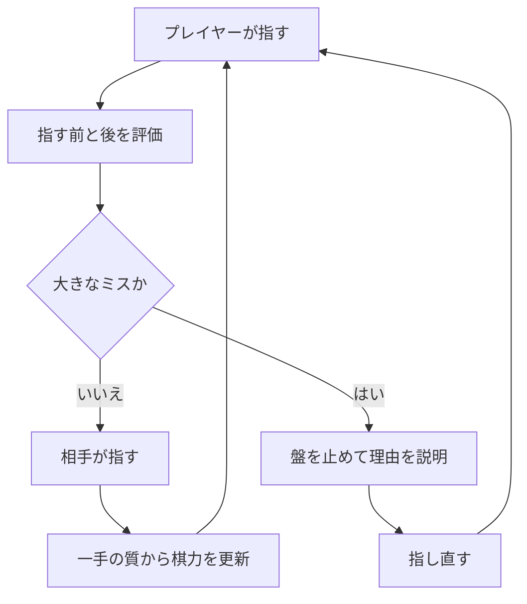
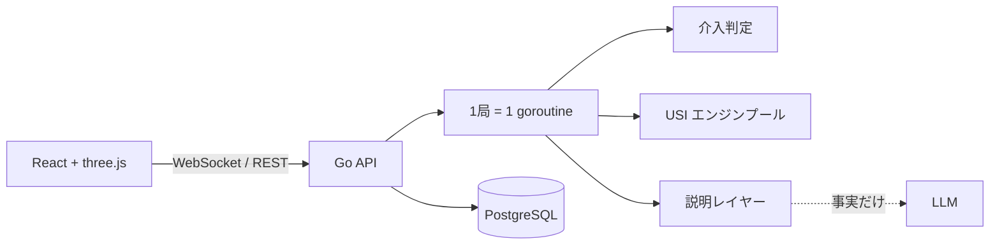

AI に何を答えさせるかではなく、**いつ割り込み、いつ黙らせるか**を設計した将棋アプリを作りました。

[show-gi](https://show-gi.com) は、初心者が大きなミスを指した瞬間だけ盤を止め、理由を説明して指し直させる対局相手です。普段は最善手を見せません。相手の強さも、対局前に選んだ数字で固定せず、プレイヤーの一手一手を見て一局の途中で変わります。

この記事では、機能を並べるだけでなく、**「教えすぎない AI」を成立させるために、プロダクトと実装をどうつないだか**を書きます。将棋のルールを知らなくても読めます。

**AI HACK** への提出作品です。LLM の呼び出しはすべて **OrcaRouter**（OpenAI 互換のメタルーター / AI ゲートウェイ）経由で、そこで起きたことも後半に書きます。

## 正解を出すだけでは、練習相手にならない

コンピュータ将棋の強さは、初心者にとって両極端になりがちです。

- 弱い設定は、不自然な場所に駒を捨てて自滅する
- 強い設定は、こちらの小さなミスを一度も見逃さない
- 解析画面は最善手を教えてくれるが、対局が終わったあとである

欲しかったのは、弱い AI でも後から採点する AI でもありません。**人が考えている最中は黙り、大きく道を外れたときだけ止め、最後は人が勝てるところまで伴走する相手**でした。

show-gi の基本ループは次のようになります。



大事なのは、介入しなかった手も観測することです。「止められた回数」だけを見れば、アプリ自身の介入ルールに汚染されたユーザーモデルになります。通過した手を含む一手ごとの損失を使います。推定は非同期で、相手を待たせない代わりに反映は一手遅れます。

## 判断はエンジン、表現だけ LLM

最初に決めた原則は、**盤面をそのまま LLM に渡して「この手はどう？」と聞かない**ことでした。

学習アプリの説明が間違っていても、初心者には検証する手段がありません。もっとも自信を持って信じる人ほど、間違った説明の影響を受けます。そこで役割を二つに分けました。

| 層                   | 担当すること                                               |
| -------------------- | ---------------------------------------------------------- |
| 将棋エンジンとルール | 悪手か、どれほど悪いか、詰みがあるか、駒が本当に取られるか |
| LLM                  | 構造化された事実を、棋力に合う短い日本語へ変える           |

たとえば「その駒は取られます」と言うには、移動先が相手に攻撃されているだけでは足りません。攻撃している駒がピンされて動けないかもしれず、取られても取り返せるかもしれません。画面で断言する前に、ルールエンジンで**合法的に取れて、取り返せない**ことまで確かめます。

LLM の出力もそのまま通しません。空文、長すぎる文、入力で許可していない升や手を含む文、途中で切れた文は捨て、同じ事実から作る決定的なテンプレートへ戻します。LLM が落ちても、対局と説明は止まりません。

つまり LLM は判断者ではなく、**上流で確定した構造化データの編集者**です。

### LLM への口は OrcaRouter 一つにした

モデルの呼び出しは **OrcaRouter** に集約しました。AI HACK の要件でもありますが、この設計とは相性がよかった——上の分業では LLM は交換可能な部品なので、**サーバ側の口は一つでよく、その先を差し替えられるほうが価値がある**からです。OpenAI 互換の HTTP なので、Go から `/chat/completions` に POST するだけで SDK も要りません。使うパラメータは実質 `model` と `temperature=0` の二つです。

そのうえで、**モデル名は既定値を信じず実測で決めました。** 同じプロンプトで測ると `google/gemini-3.5-flash-lite` が 1.0〜2.2 秒で、事実を落とさず 60 字の指示も守ります。これを既定値に固定しています。ルーターの `auto` は既定にしませんでした。推論モデルへ流れて、遅く、長くなるからです。

固定した理由は、**一晩でチャンネルの中身が変わったことがある**からです。前日まで既定にしていたモデルが、翌日は 400〜550 字・11〜17 秒で返ってきました。検証層が全部捨てるので、症状は「壊れた」ではなく**説明が 100% 決定的テンプレートに落ちる**という静かな形で出ます。

原因はこちらのプロンプトではありませんでした。同じ要求を curl で送って `usage` を見ると、

```
model=anthropic/claude-haiku-4.5    prompt_tokens 23,275   ← 送ったのは約 200 トークン
model=google/gemini-3.5-flash-lite  prompt_tokens     10   ← 同じ質問（「1+1は？」）
```

**こちらのプロンプトの前に 2 万トークン超のシステムプロンプトが載っていました。** その下に埋もれた指示（2 文以内・60 字・前置きなし）は無視され、見出し付きの解説文が返ってきます。`max_tokens` も守られませんでした。

ゲートウェイを使う以上、**チャンネルに何が載るかは自分では決められません。** そこでこの定数は「正解」ではなく**実測のスナップショット**として扱い、実キーで叩く統合テストを監視役に置きました。落ちたらプロンプトではなく**チャンネルを先に疑う**、と決めています。

呼ぶ回数も設計項目です。介入しなかった手には**そもそも呼びません**（人が指した一局 109 手のうち、説明が要る局面は 8 つでした）。そのうえで、カテゴリとレベルだけで決まる文はキーが有限なので事前生成してキャッシュに入れてあります。人が指した一局では、**説明要求の 54% がキャッシュから返り**、LLM 往復は半分以下でした。

## 「何点悪いか」ではなく、勝つ見込みをどれだけ落としたか

将棋エンジンは局面を centipawn（cp）に相当する評価値で返します。素直には、指す前の最善手と実際の手の差を cp で測ればよさそうです。

しかし、同じ 400cp の損でも意味は同じではありません。互角から 400cp 落とすのと、すでに大差のついた局面で 400cp 落とすのでは、勝敗への影響が違います。

そこで評価値をロジスティック関数で勝率へ写し、**勝率の落差**で介入します。

$$
WR(cp) = \frac{1}{1 + e^{-cp/K}}
$$

$$
\Delta = WR(\text{最善手の後}) - WR(\text{実際の手の後})
$$

初級者には広い閾値を与えて、細かなミスでは止めません。少し慣れた人には閾値を狭めます。判定パッケージの入力は、すでに計算された評価値と詰み距離だけです。盤面もエンジンも DB も知りません。そのため閾値や $K$ を変えて過去の記録を再採点するとき、エンジンをもう一度回さずに済みます。

### 終盤だけは別の物差しが要る

勝率への変換にも弱点があります。勝勢になるほど 1 に飽和し、短い詰みを逃しても勝率差がほとんど動かなくなります。

そこで終盤は、着手前に mate solver が証明した詰みの距離を起点に判定します。着手後は手番が相手なので、同じ solver では自分の詰みを直接証明できません。現状は depth 12 の mate score で、詰みが残ったか、大きく遠回りしたかを見ています。後者の正確な距離は未証明なので、説明では着手後の手数を断言しません。

止めるのは、着手前に5手以下の詰みが証明され、着手後の評価探索で詰みが消えたと見えたか、距離が3手以上延びた手だけです。11手詰めを読めなかった初心者まで叱る設計にはしません。

さらに、「詰みを逃した」と「詰みは残っているが遠回りになった」を別カテゴリにしました。実際の対局では、後者を前者と同じ文で説明したため、**勝った人に『詰みを逃した』と教える**矛盾が起きたからです。

## 最善手を隠す。ただし出口は作る

答えを見せるのが早いほど、その場の正答率は上がります。一方で、自分で読む時間は減ります。show-gi では最善手を常設せず、二つの出口だけを用意しました。

ひとつは、同じ局面で何度も止められたときのヒントです。3回で動かす駒だけ、5回で手まで示します。

もうひとつは、プレイヤーが呼ぶヒントです。同じ局面の1回目は駒だけ、2回目で手を示し、3回目はありません。一局6回までなので、答えまで見られるのは最大3手です。答えを見た局面は棋力推定から外します。**教えた答えを指したことを、本人の実力として記録しない**ためです。

この「呼ぶヒント」は最初からあった機能ではありません。着手前に手筋を自動提案する仕組みを作りましたが、人が指した3局では一度も発火しませんでした。調べると、遅さでも候補数でもなく、候補の手が最善手より大きく劣らないことを確かめるエンジンゲートが厳しいことが原因でした。

ゲートを緩めれば機能は見えるようになります。しかし「最善よりかなり悪い手」を手筋として勧める可能性も上がります。そこで精度を犠牲にせず、自動提案を切り、**必要な人が明示的に呼ぶ経路**へ変えました。

機能が動かないとき、閾値を緩めて表示回数を増やすことが正解とは限りません。とくに学習サービスでは、**出ない機能より、間違って教える機能のほうが高くつきます。**

## 相手を弱くするのではなく、少しだけ譲ってもらう

相手の強さも、エンジンの探索を浅くして作ってはいません。浅い探索は「初心者らしい手」ではなく、単に根拠の薄い手を返します。

代わりに MultiPV で上位10候補を同じ深さまで読み、次の順で選びます。

1. 置いた駒をそのまま失う自殺手を除く
2. プレイヤーが少し有利になる評価帯を決める
3. その帯を満たす中で、最小限だけ譲る手を選ぶ

基準の帯はプレイヤー視点で `+100〜+300cp` です。ただし固定ではありません。一手ごとの勝率損失から棋力を推定し、苦戦している人には帯を有利な方へ、安定して指す人には厳しい方へ動かします。

ここでも「弱い相手」と「投げる相手」を分けます。画面が「その駒は取り返せません」と教えた直後に、コンピュータが同じ捨て方をすれば、学んだルールが壊れるからです。

そして mate solver がプレイヤーの7手以下の詰みを検出したら、譲る調整を切って最善で抵抗します。最後の詰みまで相手の手加減で縮んだのか、自分で読み切ったのか分からなくなると、練習として成立しません。

## プロダクトの判断を守るための実装

この体験を支えるサーバは Go の単一サービスです。ブラウザとは対局中だけ WebSocket でつながり、USI エンジンを子プロセスとして複数起動します。



### 一局の状態は一つの goroutine が持つ

指し直し、プレイヤー自身の「待った」、解析結果の遅延到着が同時にあります。ここで HTTP ハンドラや複数の worker が盤面を直接書き換えると、更新順序そのものが壊れます。

そこで一局の状態は一つの goroutine だけが所有し、入力を channel に集めます。時間のかかる探索だけ外へ出し、結果には探索世代を付けます。戻ってきた時点で世代が違えば、古い局面への答えとして捨てます。

mutex を足すだけでは、「安全に古い結果を書き込む」ことは防げません。必要だったのは排他制御より、**どの順番だけを正しいとするか**でした。

### 時間ではなく深さで評価探索を止める

USI クライアントには `go movetime` の API を置いていません。評価探索は必ず `go depth` で行います。詰みの証明には別のクライアントから `go mate` を使います。

時間で切ると、サーバの負荷によって到達深さが変わります。すると同じ局面の評価値が揺れ、三つが同時に壊れます。

- 「同じ局面 = 同じ結果」を前提にした局面キャッシュ
- 評価帯から手を選ぶ適応型の相手
- 勝率差を閾値と比較する介入判定

途中でタイムアウトした結果もキャッシュしません。それは `depth N` の結果ではないからです。待ち時間はキャッシュや深さの調整で減らし、**サーバが忙しいから今日の相手だけ強い**という状態を避けます。

固定深さだけで完全な決定性が得られるわけではありません。スレッド数や置換表の状態も影響します。それでも、少なくとも実行時間という変数を公開 API から消すことで、製品が依存してはいけない揺れ方を一つ構造的に閉じました。

## 人が一局指すと、設計文書より多くのことが分かる

実装後は、人が最後まで指すたびに設計が変わりました。

- 298手まで続いた一局から、相手の評価帯を「絶対座標」だけで読むと、優勢になった瞬間に手加減が切れると分かった
- 修正後に105手で勝った一局では、対局中の強さ調整が動き、終局まで進めることを確認できた
- 自動手筋ヒントが3局で0回だったため、呼ぶヒントへ切り替えた
- 自分の判断で戻れる「待った」を一局3回まで追加した
- 終わった一局から、評価値グラフ、分岐を実際に指せる盤、最大4問のクイズを作った

とくに「待った」は、介入とは別に記録します。アプリに止められた手と、自分で考え直した手は、学習上の意味が違うからです。ただし、その手はすでに介入判定を通過しているので棋力推定には残します。

ここでも、画面の機能とデータの意味を同時に決めています。ボタンだけを足すと、あとから分析したときに「誰が戻したのか」が消えます。

## まだ言えないことも残す

動いていることと、十分に確かめたことは同じではありません。現時点で次は断言できません。

- 勝率変換の $K$、介入閾値、棋力推定の係数の多くは初期値のまま
- 人間の対局標本が少なく、定数を校正できていない
- 局面キャッシュはあるが、プロダクションのヒット率を測れていない
- **LLM の 1 回あたりの金額を言えない。** ホスティングの応答に単価が載らず、集計 API も 404 で、トークン数までしか事実がない。トークン数と公開価格表から掛け算して埋めることはしませんでした。その瞬間、発表の数字が自分で作った数字になります
- 先読みのための事前計算は未実装
- 手筋名は floodgate 棋譜1局を手作業で検分したところ8件中3件を誤判定し、修正後の標本も十分ではない
- 着手時刻を保存していないため、一局を通した体感遅延を数字で示せない

できた機能だけを書くと、試作品は簡単に完成品らしく見えます。しかし、教育に使う AI では**何をまだ信用していないか**も設計の一部です。

## AI の品質は、答えの品質だけではない

show-gi を作って分かったのは、AI プロダクトの難しさが「良い答えを生成すること」の外側にあるということでした。

- いつ話すか
- どこまで話すか
- 何を自分の実力として記録するか
- どの事実なら断言してよいか
- 失敗したとき、黙るか決定的な説明へ戻るか

これらを決めないまま生成品質だけを上げると、親切そうで、よく喋り、学ぶ機会を奪うコーチになります。

モデルを固定せずゲートウェイ越しに呼ぶ構成は、その意味でも都合がよいものでした。**モデルが変わっても製品が変わらない**ように作ると、「その文が言ってよい事実は何か」を先に決めることになるからです。実際、既定チャンネルが一晩で変わっても、壊れたのは説明の質だけで、対局と判定は一切止まりませんでした。

将棋は正解をエンジンで検証できるため、この問題を厳密に試せる題材でした。しかし「普段は見守り、大きく道を外れた失敗だけ止める」という介入設計は、プログラミング学習、文章推敲、操作支援など、**正解を出すだけでは人が育たない領域**にもそのまま残る問いだと思います。

[show-gi はログインなしで試せます](https://show-gi.com)。実装と設計文書は [GitHub で公開しています](https://github.com/jovid18/show-gi)。

### 実装の参照先

- [勝率落差と詰み距離による介入判定](https://github.com/jovid18/show-gi/blob/b9a21723d69d756006c7c6a6a18f71ceb68ea696/apps/server/internal/intervene/judge.go)
- [悪手カテゴリの決定的ルール](https://github.com/jovid18/show-gi/blob/b9a21723d69d756006c7c6a6a18f71ceb68ea696/apps/server/internal/intervene/category.go)
- [適応型の相手](https://github.com/jovid18/show-gi/blob/b9a21723d69d756006c7c6a6a18f71ceb68ea696/apps/server/internal/game/adaptive.go)
- [固定深さの評価探索と詰み探索を公開する USI クライアント](https://github.com/jovid18/show-gi/blob/b9a21723d69d756006c7c6a6a18f71ceb68ea696/apps/server/internal/usi/client.go)
- [OrcaRouter クライアントと検証・フォールバック](https://github.com/jovid18/show-gi/blob/b9a21723d69d756006c7c6a6a18f71ceb68ea696/apps/server/internal/explain/orca.go)

記事中の実装事実は 2026-08-14、上記コミット時点で確認しました。対局回数は開発中の人手プレイテスト、手筋名の誤判定数は floodgate 棋譜1局の手動検分で得た値であり、一般的な精度を示す統計ではありません。OrcaRouter の応答時間・トークン数・キャッシュ率も、2026-08-11〜12 に開発環境から測った少数回の値です。
