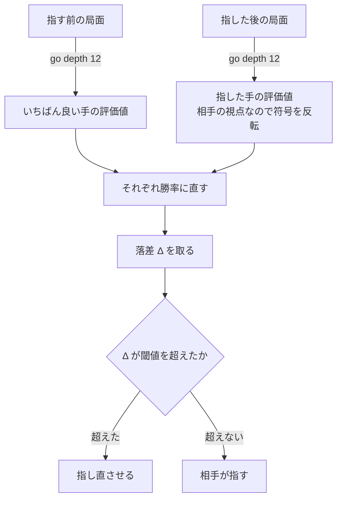

将棋の対局サービスを個人で作っています。プレイヤーが悪手を指した瞬間に割り込んで、指し直させるアプリです。

割り込むかどうかは、最後には数字ひとつと閾値の比較になります。手元にある数字はエンジンが返す**評価値**なので、素直に書けばこうなります。

```
指す前のいちばん良い手の評価値 − 実際に指した手の評価値 > 閾値 なら割り込む
```

この式が使えません。同じ 400 点の損を並べると分かります。

```
互角の局面で       0cp  →  -400cp     ← 止めたい
勝ち切っている局面で  +2000cp → +1600cp     ← 止めたくない
```

引き算の答えはどちらも 400 です。**cp の差に閾値を置いた判定は、この二つを区別できません。** 前者は形勢が入れ替わった手で、後者は勝ちが揺らいでもいない手です。

この記事で扱うのは、比べる前に評価値を**勝率に直す**という一手間です。式そのものは 1 行で、将棋やチェスのエンジンを触ったことがあれば見覚えがあるはずです。**面白いのは式ではなく、そこに一つだけ残る定数のほう**でした。校正していない定数を一つ抱えているだけで、データベースに何を保存するかまで決まってしまいます。

想定読者は、何らかのスコアを出すモデルやソルバーを持っていて、そのスコアに閾値を置いたことがある方です。将棋の知識は要りません。将棋固有の用語は出てきたところで説明します。

## 1. 何が困るのか

このアプリは、プレイヤーが一手指すたびに探索を二回走らせます。



この記事は**「それぞれ勝率に直す」の箱**の話です。ここを素通りさせて二つの評価値をそのまま引き算すると、冒頭の二例が同じ値になります。

閾値を選んでみると、どちらに寄せても外れます。

| 閾値の候補 | 何が起きるか                                                             |
| ---------- | ------------------------------------------------------------------------ |
| 200cp      | 互角の局面での小さな損まで止まる。戦法の選び方に口を出すことになる       |
| 400cp      | 勝ちが決まった局面でも延々と止め続ける。もう教えることが無いのに叱られる |
| 1000cp     | 互角から一気に不利になった手を見逃す。いちばん教えたい場所が抜ける       |

**どの一つの値でも成り立ちません。** 局面によって、同じ 400cp が別の重みを持つからです。

そしてもう一つ、より地味な問題があります。**cp は物理単位ではありません。** 同じ局面が、エンジンの設定ひとつで別の数字を返します。閾値は数字に置くものなので、数字の目盛りが動けば閾値の意味も動きます。

## 2. 評価値を勝率に直す

ここが本題です。

### 2.1 評価値 (cp) とは何か

将棋エンジンは USI というプロトコルで喋ります[^usi]。探索の途中と最後に `info` 行が流れてきて、その中に評価値が入っています。

[^usi]: UCI (チェス) の将棋版にあたるテキストプロトコルです。標準入出力で行をやりとりします。

```
info depth 14 seldepth 25 multipv 1 score cp -57 nodes 65644 ... pv 8c8d ...
```

`score cp -57` の `cp` が centipawn で、名前の由来は「歩 1 枚の 100 分の 1」です。**符号は常に手番側から見た有利・不利**で、-57 は「これから指す側が少し悪い」という意味になります。

名前は歩を基準にしていますが、**実際の目盛りを決めているのは評価関数のほう**です。やねうら王には `FV_SCALE` という設定があって、公式ドキュメントの言葉では「評価関数の出力を最後にいくつで割って整数にするか」という除数です。正しい値は評価関数ごとに決まっていて、このプロジェクトが使っている水匠5では 24、やねうら王の既定値は 16 です。

**手元で同じ局面を両方で読ませたら、こうなりました。**

```
FV_SCALE 16   score cp -134
FV_SCALE 24   score cp -57
```

同じ局面、同じ深さ、同じ手番です。ここで覚えておいてほしいのは差の大きさではなく、**設定を一つ変えると cp の目盛りごと変わる**ということです。2.5 で戻ってきます。

:::message
駒の価値 (歩 1、銀 6、飛 10 のような表) と cp は別の目盛りです。このアプリも駒の価値表を持っていますが、それは「この手で取った駒より置いた駒のほうが高いか」を訊くためだけの物差しで、cp には直しません。直すと形勢を測る目盛りが二つになって、食い違ったときにどちらが正しいのか分からなくなります。
:::

### 2.2 「悪さ」の物差しとして cp を使いたくない

学習アプリが止めたいのは「評価値を損ねた手」ではなく、**「勝敗の見込みを損ねた手」**です。この二つは同じではありません。

勝敗の見込みという物差しに直してから引き算すると、冒頭の二つが分かれます。K の意味は次の節でやるので、まずは結果だけ見てください。

| 指す前  | 指した後 | 勝率          | 落差               |
| ------- | -------- | ------------- | ------------------ |
| 0cp     | -400cp   | 50.0% → 33.9% | **16.08 ポイント** |
| +400cp  | 0cp      | 66.1% → 50.0% | 16.08 ポイント     |
| +1000cp | +600cp   | 84.1% → 73.1% | 11.01 ポイント     |
| +2000cp | +1600cp  | 96.6% → 93.5% | **3.05 ポイント**  |
| +3000cp | +2600cp  | 99.3% → 98.7% | 0.63 ポイント      |

**引き算の答えは 5 行すべて 400cp です。** それが 16 ポイントから 0.6 ポイントまで散ります。冒頭の「止めたい」と「止めたくない」に、そのまま順番がついています。

これを cp の**圧縮**と呼びます。優勢な側では、同じ cp 差が勝敗の見込みをあまり動かしません。裏を返すと、cp を直に使っている限り「-800cp」は局面ごとに別の意味の数字だということです。

### 2.3 ロジスティック関数

変換はこれ 1 行です。

$$
\mathrm{WR}(cp) = \frac{1}{1 + e^{-cp/K}}
$$

$K$ が唯一の定数で、これが記事の後半です。まず形を見ます。

- $cp = 0$ で必ず 0.5 になります。互角なら 50% です
- 単調増加します。評価値が上がって勝率が下がることはありません
- 出力が必ず 0 から 1 の間に入ります。**閾値を「勝率が何ポイント落ちたか」で持てるようになる**のはこれのおかげです
- 両端で平らになります。これが 2.6 です

**なぜこの形なのか**は、逆関数を書くと一行で出ます。

$$
\log \frac{p}{1-p} = \frac{cp}{K}
$$

左辺は**対数オッズ** (log odds) で、勝ちと負けの比の対数です。つまりロジスティック関数を使うことは、**「評価値の差は対数オッズに比例する」という仮定を一つ置くこと**と同じです。何かの理論から出てくる形ではなく、置いた仮定です。

そして $K$ の意味も、この形から一言で言えます。**オッズを $e$ 倍する cp の差**です。$K = 600$ で確かめると:

```
cp =  600 (= 1K)   勝率 73.106%   オッズ  2.718   e^1 =  2.718
cp = 1200 (= 2K)   勝率 88.080%   オッズ  7.389   e^2 =  7.389
cp = 1800 (= 3K)   勝率 95.257%   オッズ 20.086   e^3 = 20.086
```

「600 点差で勝率 73%」という言い方より、「600 点ごとにオッズが 2.7 倍になる」のほうが $K$ を触るときに効きます。傾きの定数だと分かるからです。

### 2.4 K は傾きで、掛かる手が変わる

$K$ を変えると曲線の急さが変わります。大きいほど緩やか (同じ cp 差が勝率を動かさない)、小さいほど急です。

同じ「互角から 400cp 損した手」を、$K$ だけ変えて測るとこうなります。

| $K$  | WR(+400cp) | 0cp → -400cp の落差 |
| ---- | ---------- | ------------------- |
| 200  | 88.08%     | 38.08 ポイント      |
| 300  | 79.14%     | 29.14 ポイント      |
| 600  | 66.08%     | 16.08 ポイント      |
| 1200 | 58.26%     | 8.26 ポイント       |

**4.6 倍違います。** これが閾値の側から見るとどうなるか。このアプリの閾値は棋力帯ごとに三段あって、**入門 (15 級あたりまで) が 25 ポイント、初級 (10 級から 14 級) が 18 ポイント、中級 (5 級から 9 級) が 12 ポイント**です。強い人ほど厳しくしています。「互角から 350cp 損した手」が誰に掛かるかを $K$ だけ動かして並べます。

| $K$  | 落差           | 中級 (12) | 初級 (18) | 入門 (25) |
| ---- | -------------- | --------- | --------- | --------- |
| 300  | 26.25 ポイント | 掛かる    | 掛かる    | 掛かる    |
| 450  | 18.52 ポイント | 掛かる    | 掛かる    | –         |
| 600  | 14.18 ポイント | 掛かる    | –         | –         |
| 900  | 9.60 ポイント  | –         | –         | –         |
| 1200 | 7.24 ポイント  | –         | –         | –         |

**同じ手が、$K$ の値だけで「全員に止められる手」から「誰にも止められない手」まで動きます。** 閾値を三段に分けた設計が、$K$ を一つ間違えるだけで無意味になる幅です。

### 2.5 K はどう決めるのか

**当てはめます。** (評価値, その対局の実際の結果) という対をたくさん集めて、予測した勝率が実際の勝敗の割合と合うように $K$ を選ぶ。ロジスティック回帰そのもので、機械学習でモデルの出力を確率に直すときに使う手法と同じ形です[^platt]。

[^platt]: 分類器のスコアをシグモイドで確率に直し、そのシグモイドのパラメータを検証データの正解ラベルから当てはめる手法は Platt scaling と呼ばれています。$1/(1 + e^{Af + B})$ を当てはめる形で、この記事の式は $A = -1/K$、$B = 0$ に固定したものにあたります。

ここで大事なのは、**$K$ が二つのものに依存する**ということです。

**① エンジンの cp 目盛り。** 2.1 の実測がこれです。`FV_SCALE` を 16 から 24 に変えるだけで、同じ局面の cp が -134 から -57 になりました。目盛りが変われば、その上で当てはめた傾きも変わります。**つまり他所で見た $K$ は、他所の目盛りの上の値です。**

しかも掛け算で直せません。除数が 16 から 24 なら比は 1.5 倍なので、単純な線形の変換だと -134 × 16 ÷ 24 = -89.3 のはずですが、実測は -57 でした。目盛りが変わると探索の枝刈りの判断まで変わるので、通る道が別になります。**換算式で持ち越すことはできず、当てはめ直すしかありません。**

この依存は作業の順番まで決めました。**エンジンを載せ替える作業を、判定を書く前に済ませています。** 別のエンジンで当てはめてから載せ替えると、締め切りの直前に、いちばん壊したくない定数を当てはめ直すことになるからです。git のログでもその順で並んでいて、載せ替えが 8 番目、判定が 15 番目の変更です。**「後で校正する」と決めた定数があるなら、その定数が乗っている土台を先に確定させておく**、という順番でした。

**② 誰の対局で当てはめたか。** ここが将棋固有ではない話です。「勝率」という言葉は、暗黙に**誰の勝率か**を含んでいます。+400cp の局面から実際に勝ち切る割合は、プロと 8 級で同じではありません。強い人ほど同じ評価値差から勝ち切るので、曲線は急になる — つまり $K$ は小さくなる方向です。

このアプリの対象は初心者です。**初心者の +400cp は、プロの +400cp ほど勝ちに近くない**はずで、そうであれば借りてきた $K$ は「うちのユーザーではない誰か」の曲線ということになります。

:::message alert
正直に書くと、**このプロジェクトの $K = 600$ は当てはめていない初期値です。** ソースにもそう書いてあります。上の表の数字はすべてこの 600 の上で計算したもので、当てはめ直したら全部動きます。この記事の後半 (4.4) は、そのことがスキーマまで巻き込んだ話です。
:::

### 2.6 両端で潰れる

利点の裏側です。両端が平らということは、**そこでは判定力が無い**ということです。

将棋エンジンは詰みを見つけると、cp ではなく `score mate 3` のように**手数**で返してきます。このアプリはそれを cp に直して持っています。

```go:apps/server/internal/usi/client.go
// MateCp は詰みのスコアを cp に換算するときの上限。
const MateCp = 30000

// ... info 行の解析 ...
case "mate":
	sl.IsMate = true
	sl.MateIn = v
	if v >= 0 {
		sl.ScoreCp = MateCp - 10*v
	} else {
		sl.ScoreCp = -MateCp - 10*v
	}
```

3 手詰なら 30000 − 30 = 29970cp です。これを曲線に食わせると:

```
詰み (29970cp)   →  勝率 100.0000%
      +2000cp    →  勝率  96.5555%
                    落差    3.4445 ポイント
```

**閾値はいちばん緩い入門でも 25 ポイント**です。つまり**この式だけで判定していると、詰みを丸ごと逃しても割り込みません。** しかも詰みを逃したほうが教える価値が高い局面です。

そしてロジスティック関数は原点について対称なので、**負け側でも同じことが起きます。**

```
-3000cp から詰まされる手を指す
  0.6693%  →  0.0000%     落差 0.67 ポイント
```

**これはバグではなく、この式が持っている性質です。** 「勝敗の見込み」を物差しにすると決めた時点で、勝敗の見込みが動かない場所では判定できないことも決まります。4.2 でこれに正面から刺されました。

## 3. どう使うか

必要なコードはこれだけです。そのまま `main.go` に貼れば動きます。

```go:main.go
package main

import (
	"fmt"
	"math"
)

// K は cp を勝率に変える傾き。この値の決め方が本題 (2.5)。
const K = 600.0

func winRate(cp int) float64 { return 1 / (1 + math.Exp(-float64(cp)/K)) }

// drop は「指す前のいちばん良い手」と「実際に指した手」の勝率の落差。
func drop(before, after int) float64 { return winRate(before) - winRate(after) }

func main() {
	fmt.Println("before   after    勝率            落差")
	for _, before := range []int{0, 400, 1000, 2000, 3000} {
		after := before - 400 // どこから見ても同じ 400cp の損
		fmt.Printf("%6d  %6d   %5.1f%% → %5.1f%%   %5.2f ポイント\n",
			before, after, winRate(before)*100, winRate(after)*100, drop(before, after)*100)
	}
}
```

出力です。2.2 の表がこれです。

```
before   after    勝率            落差
     0    -400    50.0% →  33.9%   16.08 ポイント
   400       0    66.1% →  50.0%   16.08 ポイント
  1000     600    84.1% →  73.1%   11.01 ポイント
  2000    1600    96.6% →  93.5%    3.05 ポイント
  3000    2600    99.3% →  98.7%    0.63 ポイント
```

式は 1 行ですが、周りで三か所つまずきました。

**① 符号を揃える場所を一つに決める。** エンジンは**常に手番側から見た**評価値を返します。指した後の局面はもう相手の手番なので、返ってくる値は相手の視点です。反転しないと引き算が意味を持ちません。

反転する場所を判定側に置くと、「これは誰の視点の数字か」がコードの二か所に散ります。このアプリは**呼ぶ側で反転してから渡す**と決めて、それを型のコメントに書いてあります。

```go:apps/server/internal/intervene/judge.go
// AfterCp は着手 **後** の局面の評価値を **指した側の視点に反転したもの**。
//
// エンジンは常に手番側の視点で答えるので、着手後は相手の視点になる。
// 呼ぶ側で符号を反転して渡す — ここで反転すると「誰の視点か」が
// 二か所に散る。
AfterCp int
```

**② 詰みを cp として食わせた瞬間、天井が平らになる。** 2.6 です。詰みは cp に直しておくと扱いが揃って便利なのですが、揃えた先が曲線の天井なので、詰みと大優勢の区別が消えます。**cp に直すこと自体は間違っていなくて、その cp を勝率に通してから引き算するのが効かない**だけです。だからこのアプリは、詰みが見えている局面では引き算をやめて手数のほうを見ます (4.2)。

**③ 表示側で計算し直さない。** 落差は 0 から 1 の値でサーバから降りてきます。画面はそれを見える単位に直すだけで、自分で計算し直しません。

```ts:apps/web/src/components/Intervention.tsx
// 落差はサーバがくれた 0〜1 の値。ここで計算し直さず、見える単位に変えるだけ。
// 棒が溢れないように切るだけにする — 数字に手を入れ始めると画面と判定が分かれる。
const drop = Math.min(100, Math.max(0, Math.round(intervention.deltaWin * 100)));
```

`Math.min` / `Math.max` は棒グラフの幅が溢れないためのもので、数字を直すためではありません。ここで丸め方を工夫し始めると、**画面に出ている数字と割り込みを決めた数字が別のものになります。**

### 判定はエンジンを知らない

もう一つ、$K$ が校正されていないことから来る構造上の決めごとがあります。**判定を受け持つパッケージの入力は、すでに求まったスカラーだけ**です。局面も、エンジンへのハンドルも入っていません。

```go:apps/server/internal/intervene/judge.go
// Input は一手を判定するのに必要な全部。
type Input struct {
	BestCp  int // 着手 **前** の局面の最善手の評価値。指す側の視点
	AfterCp int // 着手 **後** の評価値を指す側の視点に反転したもの
	// ... 詰み手数と、カテゴリを決める局面の事実 ...
	Level Level
}
```

こう切っておくと、**$K$ や閾値を振ってみる作業にエンジンが要りません。** 当てはめ直しが控えている定数を抱えている以上、これは贅沢ではなく必要です。テストも同じ性質を使っていて、エンジンを立てずに CI で回ります。

## 4. このプロジェクトで刺されたこと

### 4.1 勝率で持ったら、「初手から判定する」が成立した

設計には最初、**「序盤 20 手は割り込まない」**と書いてありました。守りたかったのは初心者が戦法をいろいろ試す余地で、序盤の小さな損に口を出したくなかったからです。

**これは意図を取り違えた規則でした。** 守りたいのは*何を指したか*の話なのに、手数で切ると **5 手目に飛車を只で渡しても見逃して、25 手目の正当な戦法の選択は助けられません。** ちょうど逆に効きます。

そして、切る必要がありませんでした。**閾値がすでにその仕事をしていました。**

| 互角からの損 | 落差           | 中級 (12) | 初級 (18) | 入門 (25)  |
| ------------ | -------------- | --------- | --------- | ---------- |
| 50cp         | 2.08 ポイント  | –         | –         | –          |
| 100cp        | 4.16 ポイント  | –         | –         | –          |
| 200cp        | 8.26 ポイント  | –         | –         | –          |
| 400cp        | 16.08 ポイント | 掛かる    | –         | –          |
| 1000cp       | 34.11 ポイント | 掛かる    | 掛かる    | **掛かる** |

戦法の選択で動く幅がこの表の上半分に収まるなら、どの棋力帯にも掛かりません。**そして駒を只で渡すような手は表の下端の桁に来て、いちばん緩い入門でも掛かります** — すぐ下に出す本番の例がそれです。例外として書いてあった「飛車・角を只で渡した場合だけは序盤でも止める」が、規則を足さずに出てきます。

なので観測区間の既定値を **0** にしました。初手から判定します。**本番では、プレイヤーの二手目 (通算 3 手目) で掛かりました。**

```
指した手   ▲3三角成    ← 角を只で渡す手
落差       0.507
画面       待った / ▲3三角成 を戻しました /
           その手は形勢を大きく損ねます。/ 勝率 −50%
結果       指し直し。棋譜は ▲7六歩 △3四歩 までに戻る
```

古い設計なら 20 手の中なので素通りしていた場所です。

:::message
**ここだけなら cp の閾値でもできます。** 600cp あたりに置けば、200cp の戦法選択は通って 1000cp の献上は止まります。**勝率の変換が要るのは反対側**です — cp の閾値は +3000 の局面でも同じ厳しさで叱り続けます。この節は「勝率にしたから手数の門が不要になった」ではなく、**「門ではなく閾値のほうに仕事をさせると決めたら、閾値の目盛りが何であるかが問題になった」**という順番です。
:::

ただし「戦法の選択で動く幅は 50 から 200cp 程度」という見立ては、**実測ではありません。** ここが外れていれば表の読み方ごと変わります。当てはめ直すべきものが $K$ の他にもう一つある、ということです。

### 4.2 飽和は事実だった — 20 手で誰も止められなくなった

判定を実エンジンにつないだ最初のテストは、初期局面から適当な手を指させるものでした。**20 手で絶望的な形勢になり、一度も割り込みませんでした。**

2.6 の負け側です。-3000cp からもっと悪い手を指しても、勝率は 0.7% から 0% にしか動かないので落差が出ません。

**直すべきバグではありませんでした。** これは「判定が意味を持つのは形勢が張っているときだけ」という事実で、そして**実際のユーザーがいるのもそこ**です。テストのほうを直して、実際の対局の中盤局面から始めるようにしました。

勝ち側の穴 (詰みを逃しても掛からない) のほうは、判定を**横に足して**埋めました。詰みが見えている局面では勝率の引き算をやめて、**詰みまでの手数**を見ます。5 手以下の詰みがあったのに、指した後でそれが消えているか大きく遠のいていたら割り込む、という形です。**置き換えではなく並置**で、負け側 (詰まされる手を指した場合) は今も勝率の落差が拾っています。

そして、その並置が成り立つ前提そのものをテストが守っています。

```go:apps/server/internal/intervene/judge_test.go
// この表が終盤の規則が必要な理由の全部だ。
func TestWinRateSaturatesWhenWinning(t *testing.T) {
	mate := WinRate(29970) // 詰みを cp に換算した値
	won := WinRate(2000)
	if d := mate - won; d > 0.05 {
		t.Fatalf("飽和が予想より弱い: Δ=%.3f", d)
	}
	// その落差がどの閾値にも届かない — だから詰み手数で判定する
	for _, l := range []Level{Beginner, Novice, Intermediate} {
		if mate-won > l.Threshold() {
			t.Fatalf("レベル %v では勝率の落差だけで掛かる — 前提が間違っている", l)
		}
	}
}
```

**このテストは実装を守っていません。前提を守っています。** $K$ を当てはめ直して「詰みと +2000cp の差がどの閾値にも届かない」が成り立たなくなったら、その瞬間に落ちます。落ちたときに考え直すのは詰み判定を足した理由のほうで、テストの数字ではありません。**校正していない定数を持つなら、その定数の上に建てた前提もテストに書いておく**というのが、ここで学んだことです。

### 4.3 いちばん効くのは互角の近く。効きすぎもする

飽和の反対側も測っておきました。**同じ 400cp の損を、始点をずらしながら**並べます。

| 指す前 | 指した後 | 落差               |
| ------ | -------- | ------------------ |
| -400cp | -800cp   | 13.06 ポイント     |
| -200cp | -600cp   | 14.85 ポイント     |
| 0cp    | -400cp   | 16.08 ポイント     |
| +200cp | -200cp   | **16.51 ポイント** |
| +400cp | 0cp      | 16.08 ポイント     |
| +800cp | +400cp   | 13.06 ポイント     |

**最大は「互角をまたぐとき」です。** +200 から -200 は互角を中心に対称な区間で、そこが曲線のいちばん急なところを丸ごと使います。実際、各閾値に届く最小の cp 損はどれも互角をまたぐ区間で出ます。

```
中級 12 ポイント   +145cp .. -145cp   = 290cp
初級 18 ポイント   +219cp .. -219cp   = 438cp
入門 25 ポイント   +307cp .. -307cp   = 614cp
```

一方、+2000cp から同じ閾値に届かせるには 980cp / 1221cp / 1447cp 必要です。**同じ一つの定数が、勝ち切った局面では 2.4 倍から 3.4 倍の損を要求します。** 教えるべき場所に判定力が集まっているという意味で、これは狙った挙動です。

**その鋭さで刺されました。**

プレイテストで「考えた手が全部戻された」という報告が出たので、実際の対局から抜いた二局面で**合法手を全部**判定に通しました。

|                      | 77 手目      | 81 手目      |
| -------------------- | ------------ | ------------ |
| 合法手               | 76           | 111          |
| いちばん良い手       | +537cp       | +433cp       |
| 入門 (25) で掛かる手 | **68 (89%)** | **89 (80%)** |
| 初級 (18) で掛かる手 | 73 (96%)     | 105 (95%)    |
| 中級 (12) で掛かる手 | 75 (99%)     | 107 (96%)    |

**どちらも勝っている局面です。** 77 手目のいちばん良い手は +537cp で、そこから入門の閾値に届く境界はおよそ **-96cp** (634cp の損) です。**合法手 76 手のうち 68 手がその線を割っていました。** 通る手は 8 手だけで、初心者がその 8 手を見つけられなければ、同じ局面で 68 回戻されます。

勝っている局面なら飽和で緩くなるはずでは、と思うところですが、+537cp は勝率 70.99% で**まだ曲線の急なところ**です。飽和が効き始めるのはもっと外側 (+2000cp あたり) だけでした。**「勝っている」と「勝ち切っている」は、この曲線の上では全然違う場所です。**

そして**この穴は $K$ では直りません。** $K$ を大きくすれば掛かる手は減ります。でも**同じ局面の中では、$K$ をどう振っても手の順位が変わりません。** 76 手すべてが同じ「いちばん良い手 (+537cp)」と比べられているので、落差の順位は指した後の評価値だけで決まり、そこに単調な変換を掛けても順位は保たれます。$K$ が動かせるのは**切る場所だけ**です。89% を通すところまで緩めれば、本当の悪手も一緒に通ります。

**基準を下げるのも効きません。** 比べる相手をいちばん良い手から 5 位の候補 (+186cp) に落とすと、境界は -96cp から **-433cp** まで下がります。それでも入ってきません。**落ちた 68 手は -500cp から -2400cp に固まっていて**、境界を 4 倍下げてもほとんど誰も届かない位置にいます。**閾値の際に並んでいるのではなく、遠くに固まっている**のでした。

そもそも「89% が悪手」を見て、うちは針の穴のような局面だと読んでいました。候補手を上から並べてみたら**上位の候補はほぼ全部が通る側**にあって、そういう局面ではありませんでした。**まともな手が 8 手あって、初心者がそれを見つけられない**だけです。この候補の並びは `k=10` の探索 1 回で出るのに、判定を書いている間、一度も見ていませんでした。

つまり直すべき方向は閾値ではありません。この式は**「この手がどれだけ悪いか」しか見ておらず、「もっと良い選択肢が実際にあったか」を見ていません。** そこに要るのは、「同じ局面で戻す回数に上限を置く」なり「見つけるのを手伝う」なりの**別の軸**です。$K$ の目盛りの上には無い話でした。

### 4.4 K が校正されていないので、スキーマが変わった

ここが、この記事でいちばん実務に効いた話です。

対局を記録し始めて、109 手の一局が入りました。**`game_moves.eval_cp` が 109 行すべて NULL** でした。桁は最初のマイグレーションからあって、値を渡す経路が無かっただけです。

これで詰まるものが三つありました。形勢の推移を後から描けない。対局相手が狙っている評価値の幅が実際に守られたか分からない。そして三つめが、この項目の順番を前に引きました。

**割り込みの判定は cp を勝率に直して使い、記録している落差はその派生値です。** 落差だけ保存すると、$K$ を当てはめ直した瞬間に**過去の対局を採点し直す方法が無くなります。** 元の cp が残っていれば、エンジンを一度も回さずに全部の対局を再採点できます。

```go:apps/server/internal/game/recorder.go
// Evaluated はその手数の局面の評価値を **後から** 埋める。**先手視点の cp** だ。
//
// Moved と分けてあるのは値を知る時点が違うからだ。判定は人が指した **後** に
// 走り、そのとき二つの局面の評価値が一度に手に入る — 人の手の後と、その
// **直前の相手の手の後** だ。だから相手の手の評価値は一手遅れて埋まる。
//
// 視点を先手に固定するのは edges.eval_by_depth と同じ規約だ。「プレイヤー
// 視点」で書くと色の違う二局を並べられない。
Evaluated(ply int, senteCp int)
```

決めたことが四つあります。

| 何を                         | どう決めたか                                                                                             |
| ---------------------------- | -------------------------------------------------------------------------------------------------------- |
| **原本は cp**                | 落差は派生値。$K$ を変えて再採点する道を閉じない                                                         |
| **視点は先手に固定**         | 「プレイヤー視点」で書くと、色の違う二局を並べられない。反転は問い合わせる側が持ち色を見てやる           |
| **手と評価値で経路を分ける** | 値を知る時点が違う。一つのメソッドにすると手を書き直すことになり、戻された手で棋譜を上書きする道ができる |
| **追加の探索は 0**           | 判定がすでに二局面を測っている。その手持ちの値を使う                                                     |

三つめは SQL の側でも守っています。評価値を埋めるクエリは `UPDATE ... SET eval_cp` だけで、**手を上書きする道がありません。** upsert にしておくと、戻された手が棋譜に入る経路ができます。

```sql:apps/server/internal/store/query/games.sql
-- 評価値だけ後から埋める。**手を上書きしない** — その手はすでに確定して
-- 入っていて、ここで書き直すと戻された手で上書きする道ができる。
--
-- 無い ply なら何もしない。評価値が手より先に来る経路は無いので、そのときは
-- 記録が失敗したということで、それをここで作って埋めると棋譜に無い行ができる。
UPDATE game_moves SET eval_cp = $3 WHERE game_id = $1 AND ply = $2;
```

四つめの代わりに、構造上埋まらない場所が二つできました。**相手の手の評価値は一手遅れて埋まり、最後の手は埋まりません。** 最後の手の後に人の手が無ければ判定も走らないからです。追加の探索を入れれば埋まりますが、埋めるために一手ごとに探索を足すのは、この二か所のために払う値段としては高い。

そして符号の向きは、**人の目には見えません。** 反転して入っていても、推移のグラフが上下反転して描かれるだけで、「幅が守られたか」に正確に反対の答えが出ます。なのでテストが**人が後手の対局まで**見ています。

**一般化するとこうです。校正していない定数を持つなら、その定数の出力ではなく入力を保存する。** 出力だけ保存すると、校正のやり直しがデータの作り直しになります。$K$ が「実測前の初期値」だと分かっていたことが、テーブルの設計を変えました。

## 5. まとめ

- **cp の差に閾値を置くと、勝ち切った局面で叱り続け、互角の近くで見落とす。** 勝率に直すと、同じ 400cp が 16 ポイントから 0.6 ポイントまで自動的に散って、その二つが同時に直る
- **代わりに両端が潰れる。** 詰みを丸ごと逃しても落差は 3.4 ポイントで、いちばん緩い閾値にも届かない。だから終盤には手数で見る判定を**横に足す** — 置き換えではない
- **$K$ が校正されていないなら、勝率ではなく cp を保存する。** $K$ はエンジンの目盛りと「誰の勝率か」の両方に依存するので、後から必ず動く。動いたときに残っていてほしいのは派生値ではなく原本のほう

---

**勝率の表はすべて $K = 600$ の上での計算です。** 測定ではないので、同じ式を書けば誰の環境でも同じ数字が出ます (3 章のコードがそれです)。

**エンジンを回して測ったのは次の数字です。** `FV_SCALE` 16 と 24 の比較 (-134 / -57)、合法手を全部判定に通した二局面 (77 手目・81 手目)、本番の割り込み (▲3三角成、落差 0.507) の三つで、いずれも 2026-08-09 から 08-10 にかけて取りました。エンジンは やねうら王 v9.40 + 水匠5 (`FV_SCALE=24`)、1 スレッド・固定深さです。`FV_SCALE` の比較だけは 16 と 24 の両方で回しています。**エンジンや評価関数を変えれば cp は変わり、2.5 のとおり $K$ も変わります。**

4.3 の候補手の並び (5 位 +186cp、境界 -433cp、落ちた 68 手が -500 から -2400cp) は、判定に使ったのとは**別の探索** (`depth 12` × 候補 10) で取った値です。そのため同じ手の評価値が判定側の数字と数 cp ずれます — 境界のすぐ際にいる手の順位は、この差で入れ替わります。

閾値 (25 / 18 / 12 ポイント)、$K$ (600)、そして 4.1 の「戦法の選択は 50 から 200cp」は**いずれも当てはめ前の初期値・見立て**です。

本文で引用したコードは、以下のコミット時点のものです。**コメントは原文が韓国語なので日本語に訳し、本筋から外れる行は省いています** — 原文はリンク先で読めます。

- [`internal/intervene/judge.go` — `K` と `WinRate`](https://github.com/jovid18/show-gi/blob/cbaf994b62f6b18083c8783fb707d880f510006d/apps/server/internal/intervene/judge.go#L12-L24)
- [`internal/intervene/judge.go` — 棋力帯ごとの閾値](https://github.com/jovid18/show-gi/blob/cbaf994b62f6b18083c8783fb707d880f510006d/apps/server/internal/intervene/judge.go#L39-L49)
- [`internal/intervene/judge.go` — `Input` と `Judge`](https://github.com/jovid18/show-gi/blob/cbaf994b62f6b18083c8783fb707d880f510006d/apps/server/internal/intervene/judge.go#L59-L130)
- [`internal/intervene/judge_test.go` — 前提を守るテスト](https://github.com/jovid18/show-gi/blob/cbaf994b62f6b18083c8783fb707d880f510006d/apps/server/internal/intervene/judge_test.go#L19-L32)
- [`internal/usi/client.go` — 詰みを cp に換算する](https://github.com/jovid18/show-gi/blob/cbaf994b62f6b18083c8783fb707d880f510006d/apps/server/internal/usi/client.go#L560-L571)
- [`internal/game/recorder.go` — `Evaluated`](https://github.com/jovid18/show-gi/blob/cbaf994b62f6b18083c8783fb707d880f510006d/apps/server/internal/game/recorder.go#L28-L36)
- [`internal/store/query/games.sql` — 評価値だけ埋める](https://github.com/jovid18/show-gi/blob/cbaf994b62f6b18083c8783fb707d880f510006d/apps/server/internal/store/query/games.sql#L44-L49)
- [`apps/web/src/components/Intervention.tsx` — 落差の表示](https://github.com/jovid18/show-gi/blob/cbaf994b62f6b18083c8783fb707d880f510006d/apps/web/src/components/Intervention.tsx#L41-L43)
