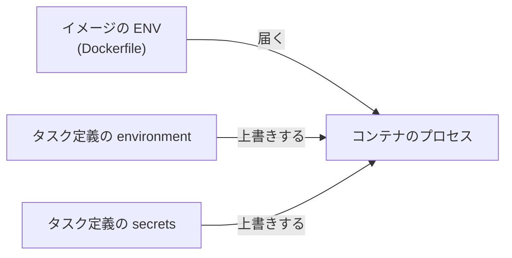
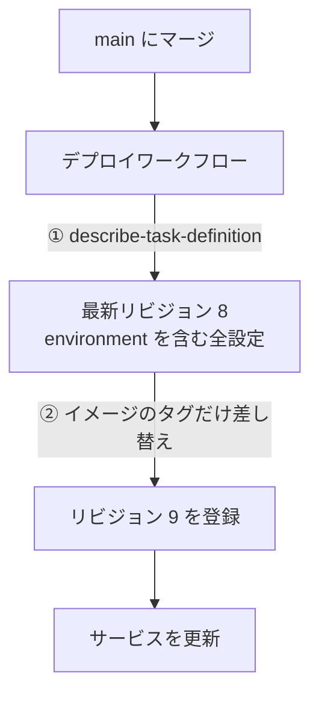

将棋の対局サービスを個人で作っています。対局エンジンを差し替えるプルリクエストをマージしたら、GitHub Actions は最後まで緑、ECS のデプロイも「安定」で完了、サイトも普通に開きました。**対局だけができません。**

```
https://show-gi.com          200
https://show-gi.com/healthz  {"ok":true}
https://show-gi.com/ws/game  503  {"error":"engine_unavailable"}
```

原因は一行でした。**イメージに書いた `ENV` が、ECS のタスク定義に残っていた古い環境変数に負けていた**のです。

この記事で扱うのは「コンテナに環境変数が入る経路」と「ECS のタスク定義がデプロイのたびに何を引き継ぐか」の二つです。この二つが噛み合うと、**イメージ側をいくら直しても本番が変わらない**という状態になります。

想定読者は、Docker イメージを作って ECS (Fargate) で動かしたことがある方です。将棋の知識は要りません。

## 1. 何が困るのか

同じ設定値が「イメージの中」と「オーケストレータの中」の二箇所にあると、三つのことが同時に起こります。

- どちらが勝つかを知らないと、両方を読んでも結論が出ない
- 片方だけ直しても直らない
- そして **何のエラーも出ない**

三つめが厄介です。今回はこうなっていました。

```
Dockerfile      ENV ENGINE_CMD=/opt/yaneuraou/run
タスク定義      ENGINE_CMD=fairy-stockfish        ← こちらが勝つ
```

もともと、この値は**二箇所に同じ内容で書いてありました。** イメージにも `ENV ENGINE_CMD=fairy-stockfish`、タスク定義にも `fairy-stockfish`。同じ値なので、どちらが勝っても結果は変わりません。**だから今まで一度も表に出ませんでした。**

エンジンを別の実装に乗り換えたとき、書き換えたのは**イメージ側だけ**でした。重複した設定は、二つがずれた瞬間にはじめて姿を現します。サーバは存在しないバイナリを起動しようとして、エンジンのプロセスプールを立ち上げられませんでした。

そしてこのサーバは、**エンジンが無くてもプロセスを終了しない**設計です。

```go:apps/server/cmd/api/main.go
// エンジンが無いからといってプロセスを殺さない。殺すと ECS が再起動を繰り返し、
// /healthz ごと消えてサイト全体が落ちる。対局だけを止めて、残りは生かす。
func startEngines() *usi.Pool {
	cmd := os.Getenv("ENGINE_CMD")
	if cmd == "" {
		log.Print("ENGINE_CMD is not set — games are disabled")
		return nil
	}
	// ...
	pool, err := usi.NewPool(size, cmd, opts)
	if err != nil {
		// 今回通ったのはここです。存在しないバイナリなので起動に失敗します
		log.Printf("cannot start engine pool (%s x%d) — games are disabled: %v", cmd, size, err)
		return nil
	}
	return pool
}
```

この判断自体は正しくて、実際にここで効きました。もしエンジンの失敗でプロセスを落としていたら、ECS がタスクの再起動を延々と繰り返して**サイト全体が落ちていた**はずです。

代わりに、静かに壊れました。

## 2. コンテナの環境変数はどこから来るのか

ここが本題です。まず経路を全部並べて、そのあとで優先順位を見ます。

### 2.1 経路は四つある

| 経路               | 書く場所                           | 性質                                               |
| ------------------ | ---------------------------------- | -------------------------------------------------- |
| イメージの `ENV`   | Dockerfile                         | イメージに焼き込まれる。どこで動かしても付いてくる |
| `environment`      | タスク定義                         | キーと値をそのまま持つ。コンソールから見える       |
| `environmentFiles` | タスク定義 (S3 の `.env`)          | 値をまとめて外に出せる                             |
| `secrets`          | タスク定義 (SSM / Secrets Manager) | 値がタスク定義にもログにも残らない                 |

役割で分けると、`ENV` は**イメージの内部構造**を書く場所、タスク定義の三つは**そのイメージを今回どう動かすか**を書く場所です。この区別が後で効きます。

### 2.2 実行時に渡した値が、イメージに勝つ

Docker の基本ルールです。`docker run -e` で渡した値は、イメージの `ENV` を上書きします。

そして **ECS のタスク定義の `environment` は、ちょうどこの `-e` の位置にいます。**



**同じキーが両側にあれば、必ずタスク定義が勝ちます。** 図には描いていませんが `environmentFiles` も同じ側です。

言い方を変えると、タスク定義に一度キーを書いた瞬間、**そのキーについてイメージ側の記述は意味を失います**。イメージを差し替えても、`ENV` を書き換えても、コンテナに入る値は変わりません。

### 2.3 値を空にしても「未設定」にはならない

これは手元で確かめられます。

```sh
docker build -t envdemo - <<'EOF'
FROM alpine
ENV ENGINE_CMD=/opt/engine/run
CMD ["sh", "-c", "echo ENGINE_CMD=$ENGINE_CMD"]
EOF

docker run --rm envdemo                                # ENGINE_CMD=/opt/engine/run
docker run --rm -e ENGINE_CMD=fairy-stockfish envdemo  # ENGINE_CMD=fairy-stockfish
docker run --rm -e ENGINE_CMD= envdemo                 # ENGINE_CMD=
```

三行目が落とし穴です。空文字を渡すと、イメージの `ENV` は**空文字で上書きされます**。消えるのではありません。

Go の `os.Getenv` は、未設定のキーも空文字のキーも同じ `""` を返します。つまり `ENGINE_CMD=` を置いた瞬間、先ほどのコードは「設定されていない」と判断して**対局を無効にしたまま普通に起動します**。

:::message alert
タスク定義から設定を外すときは、**値を空にするのではなくキーごと削除する**必要があります。
:::

### 2.4 タスク定義はイミュータブルなリビジョン

ECS のタスク定義は上書き更新されません。`show-gi:8`、`show-gi:9` のように、**登録するたびに新しいリビジョンが増えます**。サービスは、そのうちの特定の一つを指しています。

```
show-gi:6  ACTIVE
show-gi:7  ACTIVE   ← サービスが今指しているのはここ
show-gi:8  ACTIVE   ← terraform apply が登録したばかり。まだ誰も使っていない
```

したがって Terraform でタスク定義を直しても、それは**新しいリビジョンが一つ増えるだけ**です。サービスが指す先が切り替わらない限り、本番のコンテナは何も変わりません。

### 2.5 デプロイは「最新のリビジョン」を引き継ぐ

ここが最後のピースです。

ECS へのデプロイでよく使われる方法は、**現在のタスク定義 (最新リビジョン) を読み出して、イメージのタグだけ差し替えて登録し直す**というものです。読み出しは `aws ecs describe-task-definition`、差し替えは AWS 公式のアクション `amazon-ecs-render-task-definition` が担当します。



つまり、**タスク定義に一度書かれた環境変数は、以後のデプロイに自動で引き継がれていきます。** 誰かが明示的に消すまで、永遠に。

2.2 から 2.5 までを並べると、今回の状態が説明できます。

- イメージの `ENV` を直しても、タスク定義の値が勝つので効かない (2.2)
- Terraform を直しても、新リビジョンが増えるだけで本番は変わらない (2.4)
- マージしても、ワークフローが**`ENGINE_CMD` を持ったままの最新リビジョン**を読んで引き継ぐので変わらない (2.5)

三方向どれからやっても直らない、という状況でした。

### 2.6 では、どちらに書くべきか

判断はこうしました。

**イメージの内部構造を指す値は、タスク定義に書かない。**

エンジンの実行パス (`/opt/yaneuraou/run`) は、そのイメージの中にしか存在しないファイルです。イメージを作った側だけが知っている値で、Terraform からは知りようがありません。両方に書けば、**イメージを差し替えたときに静かにずれます**。

逆に、プールのサイズやハッシュテーブルの容量のような運用のつまみは、タスク定義に置いて構いません。イメージの中に対応する値が無いので、上書きする相手がいないからです。

```diff hcl
  {
    name  = "api"
    image = local.api_image

-   environment = [
-     { name = "ENGINE_CMD", value = "fairy-stockfish" },
-   ]
+   # ENGINE_CMD はここに置かない。エンジンの実行パスはイメージの内部構造で、
+   # Terraform からは知りようがない値だからだ。両方に書くと、イメージを
+   # 差し替えたときに静かにずれる。
+   environment = []
  }
```

## 3. 今そこに何が入っているのかを見る

事故のときに一番知りたかったのは「**本番のコンテナに今どの値が入っているのか**」でした。当時はログをすぐ引ける手段を用意しておらず、タスク定義を直接読みにいきました。

順番があります。**先にサービスが使っているリビジョンを特定してから**、そのリビジョンを読みます。

```sh
aws ecs describe-services --cluster show-gi --services show-gi \
  --query 'services[0].taskDefinition' --output text
# arn:aws:ecs:ap-northeast-1:...:task-definition/show-gi:9
```

```sh
aws ecs describe-task-definition --task-definition show-gi:9 \
  --query 'taskDefinition.containerDefinitions[?name==`api`].environment'
```

:::message alert
`--task-definition` に **family 名だけ** (`show-gi`) を渡すと、そのファミリーの**最新の ACTIVE リビジョン**が返ります。サービスが動かしているものとは限りません。`terraform apply` で新しいリビジョンを登録した直後は、まさにこの二つがずれています。
:::

リビジョン番号まで指定して読めば、「イメージは新しいのに設定が古い」状態がその場で見えます。

## 4. 踏んだこと

### 4.1 壊れ方を穏やかにすると、壊れたことが見えなくなる

一番の学びはこれでした。

このサーバは、エンジンが起動しなくても `/healthz` を返し続けます。そして当時の `/healthz` は、**エンジンを一切見ていませんでした**。

```
/healthz  →  {"ok":true}
```

結果、ALB のヘルスチェック (`/healthz`) は通り、ECS はタスクを健全と見なし、「安定」を待っていたデプロイワークフローも緑で終わりました。サイトを開いても普通に表示されます。壊れているのは `/ws/game` だけで、そこは**実際に対局を始めようとした人にしか見えません**。

「エンジンが無くてもプロセスを殺さない」という判断は正しかったのです。殺していればサイト全体が落ちていました。しかし**穏やかな劣化は、劣化を見えなくもします。**

だから、劣化して生き延びる設計を選ぶなら、**その劣化を外から見える場所に出す**のがセットです。ヘルスチェックに状態を足しました。

```go:apps/server/internal/server/server.go
// エンジンが無くても 200 を返す。ここで失敗を出すと ECS がタスクを殺して
// 再起動を繰り返し、サイト全体が落ちる。代わりに engine フィールドで状態を出す。
// これが無いと「デプロイは成功したのに対局だけできない」状態に誰も気づけない。
writeJSON(w, http.StatusOK, map[string]any{
	"ok": true, "engine": engineReady, "db": dbReady,
})
```

そのうえで、**デプロイワークフローがこのフィールドを確認して落ちるように**しました。人間が気づくかどうかに任せません。

```yaml:.github/workflows/images.yml
# ECS が「安定」と言っても対局できるかは分からない。/healthz は engine が false でも
# 200 を返すので、ALB もワークフローも緑のままだ。実際に一度そうなった。
- name: Verify the engine came up
  run: |
    body="$(curl -fsS --retry 5 --retry-delay 5 https://show-gi.com/healthz)"
    echo "$body"
    if [ "$(printf '%s' "$body" | jq -r .engine)" != "true" ]; then
      echo "デプロイはできたがエンジンが上がっていない — 対局が不可能な状態だ"
      exit 1
    fi
```

ヘルスチェックは、**それが見ているものしか守れません。** プロセスが生きたまま機能だけを失う設計を選んだなら、見る対象もそこに合わせる必要があります。

### 4.2 直す順番が決まっている

`ecs.tf` を直してマージすれば終わり、とはいきません。2.5 の通り、ワークフローは**AWS にある最新のリビジョンを読む**からです。

```sh
terraform -chdir=infra apply   # ① ENGINE_CMD を持たない新リビジョンを登録する
                               #    plan はタスク定義 1 個の置き換えだけになる
# ② そのあとマージ。ワークフローが①のリビジョンを読んでデプロイする
```

順番を逆にすると、ワークフローが古いリビジョンを読んで**同じように壊れたものを配り直します**。直すにはもう一度 apply して、さらにワークフローを再実行することになり、三手かかります。

### 4.3 古いリビジョンを消させない

タスク定義のリソースには `skip_destroy = true` を付けました。

```hcl:infra/ecs.tf
resource "aws_ecs_task_definition" "app" {
  skip_destroy = true
  # ...
}
```

これが無いと、apply が新しいリビジョンを登録するときに古いものを deregister します。すると二つ困ります。

- 手順書に書いた**ロールバック先 (「一つ前のリビジョンに戻す」) が INACTIVE を指す**
- apply 直後の一瞬、サービスが指しているリビジョンが INACTIVE になり、その間にタスクが死ぬと**復帰できない**

実際 apply は `1 destroyed` と表示しましたが、古いリビジョンは ACTIVE のまま残っていました。デプロイワークフローが Terraform の外でリビジョンを積み続ける構成なので、ここで整理しても得るものはありません。

## 5. まとめ

- **タスク定義の `environment` は、イメージの `ENV` を上書きする。** そして二箇所に書いた値は、同じである限り何も起こさない。**ずれた瞬間にだけ牙をむく**
- **タスク定義はデプロイのたびに引き継がれる。** イメージを直しても Terraform を直しても、そこに残った値は消えない
- **穏やかに劣化する設計には、劣化を外に出す義務がセットで付いてくる。** 機能を見ていないヘルスチェックは、緑になれる嘘でしかない

---

検証は 2026-08-09 に発生した事象を、2026-08-10 時点のコードで確認しました。本文で引用したコードは、以下のコミット時点のものです。

- [`infra/ecs.tf` — タスク定義の `environment`](https://github.com/jovid18/show-gi/blob/0b4bc30ab62b8a3ae10e57950eeecaf0a48e0919/infra/ecs.tf#L163-L174)
- [`apps/server/cmd/api/main.go` — エンジンが無くても起動する](https://github.com/jovid18/show-gi/blob/0b4bc30ab62b8a3ae10e57950eeecaf0a48e0919/apps/server/cmd/api/main.go#L95-L123)
- [`apps/server/internal/server/server.go` — `/healthz`](https://github.com/jovid18/show-gi/blob/0b4bc30ab62b8a3ae10e57950eeecaf0a48e0919/apps/server/internal/server/server.go#L57-L77)
- [`.github/workflows/images.yml` — デプロイ後にエンジンを確認する](https://github.com/jovid18/show-gi/blob/0b4bc30ab62b8a3ae10e57950eeecaf0a48e0919/.github/workflows/images.yml#L120-L130)
