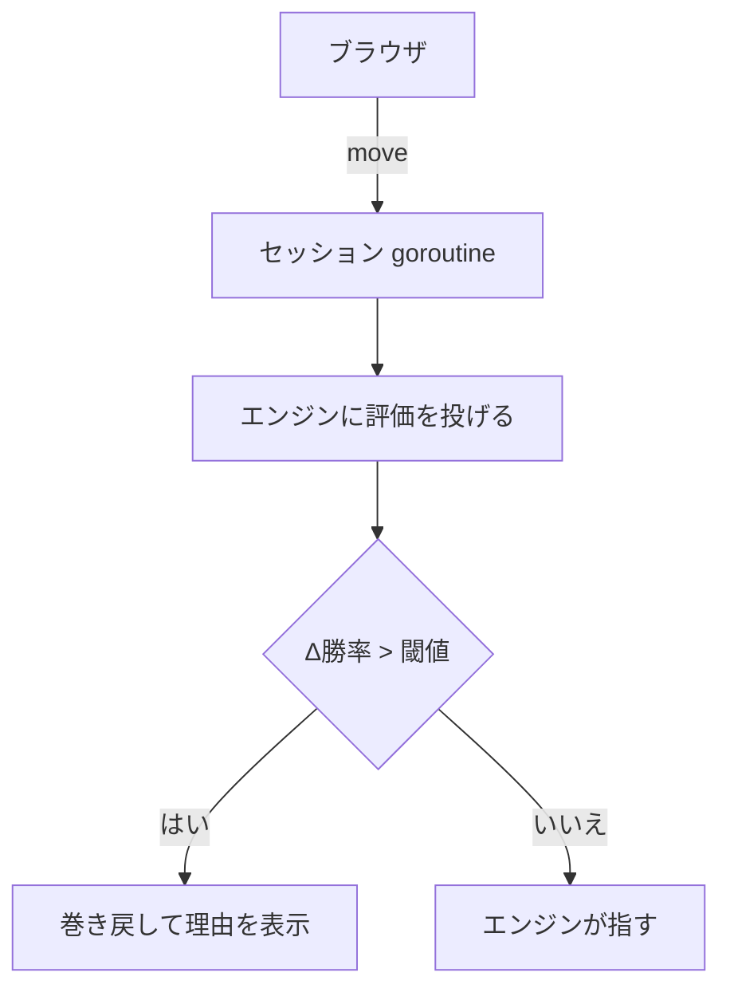

:::message alert
この記事は連携と記法の動作確認用です。確認が終わったら削除します。
:::

## 何を確かめる記事か

[show-gi](https://github.com/jovid18/show-gi) というプロダクトの開発記録を Zenn に連載する準備をしている。本文を書き始める前に、**GitHub 連携が実際に動くか**と、**使う予定の記法が想定どおり描画されるか**を一度に確かめておく。

記法が壊れることに 40 本書いたあとで気づくと、直す先が 40 箇所になる。

## 1. コードブロック

ファイル名ラベルつき。

```go:apps/server/internal/usi/client.go
func (e *Engine) SearchDepth(ctx context.Context, depth int) (*SearchResult, error) {
	return e.search(ctx, fmt.Sprintf("go depth %d", depth))
}
```

差分表示。実際にプロダクションで対局だけができなくなったときの修正がこれだった。

```diff hcl
  environment = [
-   { name = "ENGINE_CMD", value = "fairy-stockfish" },
    { name = "ENGINE_POOL_SIZE", value = "3" },
  ]
```

エンジンの実行パスはイメージ内部の構造なので、タスク定義に書くと**イメージを差し替えたときに静かにずれる**。

## 2. Mermaid



## 3. メッセージとアコーディオン

:::message
`PvInterval` の既定値は 300ms だ。探索がそれより速いと、深さごとの評価値が最後のひとつしか残らない。**エラーは出ない。**
:::

::::details 長いログを畳む
:::message
入れ子にするときは外側のコロンを増やす。
:::

```
DepthLimit=7    最長 118ms   詰みあり  9/162   未証明 0
DepthLimit=11   最長 124ms   詰みあり 10/162   未証明 0   ← 採用
DepthLimit=15   最長 833ms   詰みあり 10/162   未証明 0
```

::::

## 4. 数式

評価値を勝率に直す式。

$$
P(\text{win}) = \frac{1}{1 + 10^{-\frac{cp}{K}}}
$$

インラインは $K = 600$ と書く。この $K$ はまだ初期値で、実測で決め直す。

## 5. 表

深さと候補数の実測。**帯の的中は k が決め、時間は depth が決める。**

| k \ depth | 10        | 12       | 14    | 的中(10) | 的中(12) | 的中(14) |
| --------- | --------- | -------- | ----- | -------- | -------- | -------- |
| 1         | 144ms     | 400ms    | 767ms | 0        | 0        | 0        |
| 5         | 318ms     | 956ms    | 4.0s  | 4        | 4        | 5        |
| **10**    | **609ms** | **2.0s** | 8.4s  | **5**    | **5**    | **5**    |
| 20        | 967ms     | 3.3s     | 23.5s | 5        | 5        | 5        |

## 6. 埋め込み

リンクカード。

@[card](https://zenn.dev/zenn/articles/markdown-guide)

GitHub のファイル。行範囲を指定できる。

https://github.com/jovid18/show-gi/blob/7292a8c/README.md#L1-L11

## 7. 脚注と引用

やねうら王も NNUE も GPLv3 だ[^1]。

[^1]: エンジンはパイプの向こうの別プロセスなので、ライセンスがこちらのコードに伝播しない。ただしイメージにバイナリを含めるのは配布にあたるので、ビルドしたタグを Dockerfile に残してある。

> 判定はエンジン、表現だけを LLM に任せる。学習アプリで説明が間違っていると、初心者には検証する手立てがない。

## 確認できていないもの

**画像はこの記事では試していない。** `/images` に置いて絶対パスで参照する仕組みだが、まだ載せる画像がひとつもない。最初の図版を作るときに合わせて確かめる。
