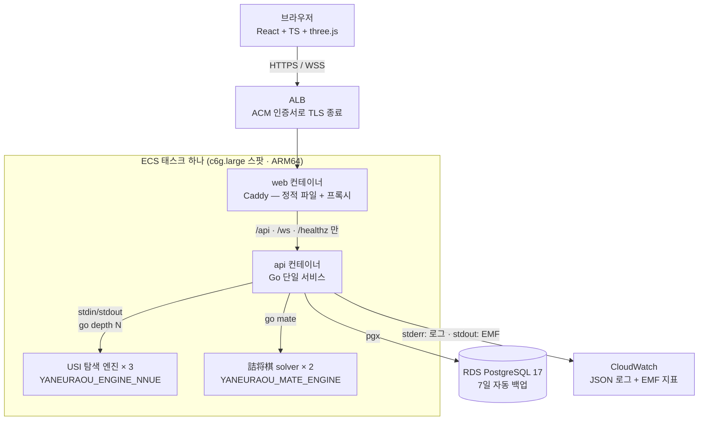
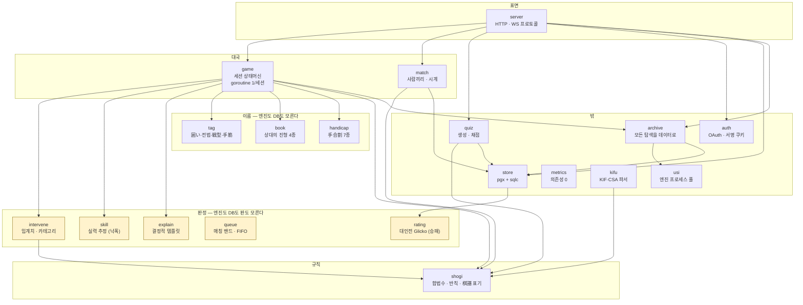
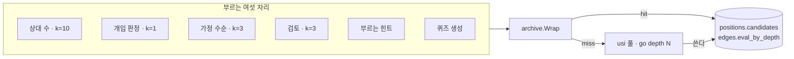
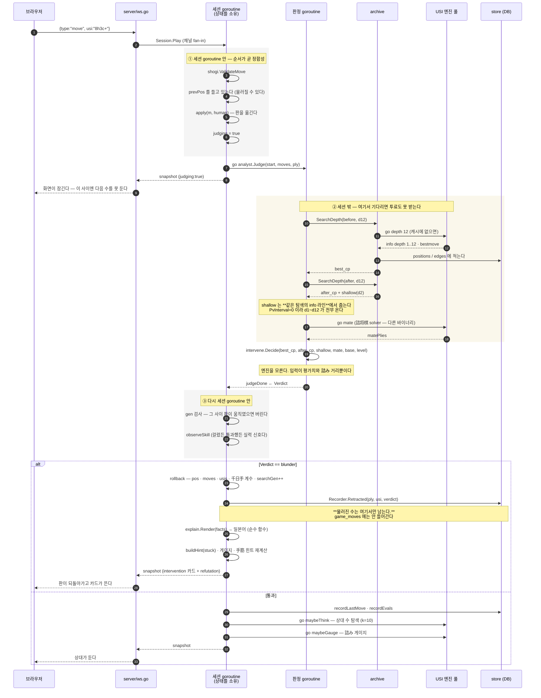
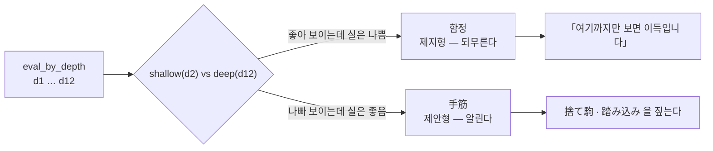
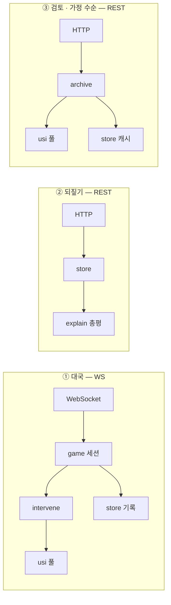
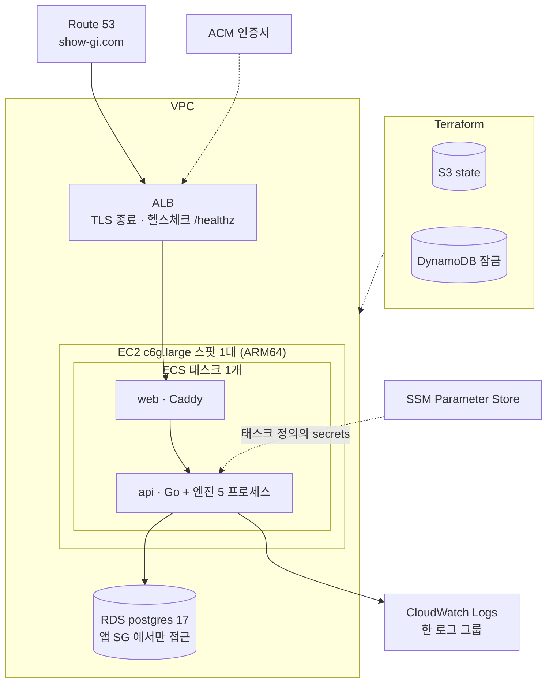
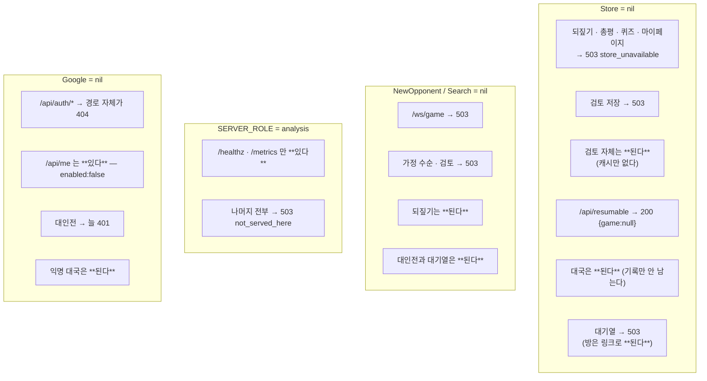

# 전체 아키텍처 — 그림 여섯 장

**이 문서는 그림만 든다.** 왜 그 결정을 했나(Go · LLM 없음 · 그래프 DB 없음 · 시간 대신 깊이)는 [02-architecture](../02-architecture.md)에 있고, 여기서 다시 쓰지 않는다.

|                                              |                                      |
| -------------------------------------------- | ------------------------------------ |
| [§1](#1-시스템-구성) 시스템 구성             | 무엇이 무엇에 붙어 있나              |
| [§2](#2-서버-내부--패키지-열여덟) 서버 내부  | 패키지 열여덟과 **모르는 것의 방향** |
| [§3](#3-개입-루프--이-제품의-코어) 개입 루프 | **한 수가 물러지기까지** (시퀀스)    |
| [§4](#4-세-갈래-요청-경로) 요청 경로         | WS 대국 · REST 되짚기 · 검토         |
| [§5](#5-배포-토폴로지) 배포 토폴로지         | AWS 실물                             |
| [§6](#6-무엇이-없으면-무엇이-꺼지나) 열화 표 | nil 이면 죽지 않고 그 기능만 꺼진다  |

---

## 1. 시스템 구성



**엔진이 두 종류다.** 같은 소스를 다른 `YANEURAOU_EDITION` 으로 두 번 빌드한다 — 탐색부에 `go mate` 를 보내면 `bestmove` 가 돌아오고, solver 쪽만 규격대로 `checkmate G*5b` 를 준다.

**`/metrics` 는 Caddy 가 프록시하지 않는다.** 그래서 태스크 안에서만 열린다 — 프로덕션에서 실제로 보는 것은 stdout 으로 나가는 EMF 쪽이고, 지표 수집기를 따로 띄우지 않는다(태스크가 한 대뿐이라 Prometheus 를 세우는 값이 안 나온다).

**스레드는 엔진당 1로 고정한다.** 동시성은 풀에서 얻는다 — 멀티스레드는 고정 깊이에서도 결과가 흔들려 `positions` 캐시를 못 쓰게 만든다.

---

## 2. 서버 내부 — 패키지 열아홉

**화살표는 「부른다」다. 화살표가 없는 것이 이 그림의 내용이다.**



### 없는 화살표 여덟이 설계다

| 없는 것                 | 뜻                                                                                                                           |
| ----------------------- | ---------------------------------------------------------------------------------------------------------------------------- |
| `intervene` → `usi`     | **개입 판정은 엔진을 모른다.** 입력이 이미 구해진 평가치와 詰み 거리뿐이라, 상수(K·임계치)를 흔들어 보는 데 엔진이 필요 없다 |
| `skill` → 무엇이든      | **판도 DB도 모른다.** 입력이 낙폭과 「걸렸나」뿐이다                                                                         |
| `rating` → 무엇이든     | 같은 성질이다 — 입력이 두 사람의 지금 레이팅과 승패뿐이다. **어느 API 도 이 값을 안 돌려준다**                               |
| `explain` → `intervene` | **판단하지 않는다.** 정해진 사실을 문장으로만 바꾼다 — 순수 함수라 되무르는 자리에서 불러도 판정과 문장이 갈릴 길이 없다     |
| `tag` → `usi` · `store` | 국면과 수순만 받는다                                                                                                         |
| `match` → `usi`         | **대인전은 엔진을 안 부른다.** 개입도 힌트도 待った도 없다 — 그 갈래에 판정이 아예 배선되지 않았다                           |
| `queue` → `store`       | **밴드 식이 DB 를 모른다.** 질의는 잠그고 오래된 순으로 주고, 고르는 것만 여기가 한다 — 식을 SQL 에도 적으면 두 벌이 된다    |
| `queue` → `match`       | 줄은 방을 모른다. 짝을 지어 방을 세우는 것은 `server` 다 (표 먼저 · 방 나중)                                                 |

`server` 가 `store` 를 직접 부르는 화살표가 있는 것은 되짚기·마이페이지 쪽이다. **대국 상태는 다르다** — HTTP 핸들러가 그것을 직접 읽기 시작하면 그 순간 구조가 무너진다.

### 엔진 호출이 지나는 한 겹



`cmd/api/main.go` 가 `archive.Wrap` **하나**를 그 여섯에 나눠 준다. 캐시 판정은 깊이만으로 안 되고 **「같은 깊이면 후보가 많은 쪽이 이긴다」**다 — 같은 깊이에서도 MultiPV 가 갈리기 때문이다.

---

## 3. 개입 루프 — 이 제품의 코어

### 3.1 판정식

```
WR(cp) = 1 / (1 + exp(-cp / K))          K = 600
Δ      = WR(before_best - base) - WR(after_move - base)
개입    = Δ > threshold(level)
```

`base` 는 그 판의 **「형세 0」**이다. 平手는 0, 駒落ち는 그 手合의 초기 평가치다.

| 손해   | Δ승률  | 중급 12%p | 초급 18%p | 입문 25%p |
| ------ | ------ | --------- | --------- | --------- |
| 100cp  | 4.2%p  | –         | –         | –         |
| 200cp  | 8.3%p  | –         | –         | –         |
| 400cp  | 16.1%p | 걸림      | –         | –         |
| 1000cp | 34.4%p | 걸림      | 걸림      | **걸림**  |

**전법 선택은 보통 50\~200cp** 라 어느 레벨도 안 걸리고, **銀 이상을 공짜로 주면 제일 너그러운 입문에서도 걸린다.** 그래서 「초반 N수는 개입 안 함」이라는 구간이 없다 — 관측 구간의 기본값은 **0**이고 첫 수부터 판정한다. 자세한 것은 [01-core §2](../01-core.md#2-판정식).

### 3.2 한 수가 물러지기까지



### 이 그림이 말하는 것 넷

**① 판정이 상대 수보다 먼저 돈다.** 상대 수를 먼저 두면 롤백이 되돌릴 것이 **둘**이 된다. 그래서 롤백은 `prevPos` 한 장으로 끝난다 — 사람이 스스로 무르는 待った 는 이미 확정된 상대의 응수까지 **2手** 를 되감아야 해서 구조가 다르다.

**② 롤백은 국면만 되돌리는 게 아니다.** 판·기보·표기·千日手 계수까지 전부다 — 하나라도 남으면 다음 판정이 그 흔적 위에서 돈다. `searchGen++` 는 물러진 국면에 대한 **늦게 도착한 결과를 버리기 위한** 것이다.

**③ 통과한 수도 실력 신호다.** 물러진 수만 세면 표본이 개입에 오염되고, 통과한 수만 세면 제일 큰 실수가 안 들어온다.

**④ 판정이 실패해도 대국은 안 멈춘다.** 대신 조용히 넘기지도 않는다 — **개입이 없는 화면은 「이 수는 괜찮았다」와 똑같이 생겼는데**, 판정 실패는 확인 자체를 못 한 것이다. 그래서 `notice` 가 따로 뜬다.

### 3.3 하나의 배열이 개입의 두 방향을 정의한다

`edges.eval_by_depth` 하나에서 나온다.



초보자는 깊게 읽지 않으므로, **얕은 평가와 깊은 평가의 차이가 곧 「초보자에게 보이는 것과 실제의 격차」**다. 그 격차의 **부호**가 양쪽 개입을 그대로 정의한다.

> 단 얕은 값은 MultiPV info 라인에서 못 줍는다. 捨て駒는 얕은 깊이에서 상위 k 에 안 들어와 애초에 라인에 없다 — **손해로 보이는 것이 그 수의 정의다.**

---

## 4. 세 갈래 요청 경로

같은 서버인데 지나는 층이 다르다. **무엇이 없으면 무엇이 꺼지는지**가 이 그림에서 나온다.



| 갈래        | 엔진     | DB          | 로그인                |
| ----------- | -------- | ----------- | --------------------- |
| ① 대국      | **필수** | 없어도 된다 | 없어도 된다 (익명 판) |
| ② 되짚기    | 무관     | **필수**    | 없어도 된다           |
| ③ 가정 수순 | **필수** | **필수**    | 없어도 된다           |
| ③ 검토      | **필수** | 캐시로만    | 불필요                |
| 대인전      | 무관     | 기록만      | **필수**              |

**되짚기가 엔진에 안 매인 것이 의도다** — 엔진이 죽어 대국을 못 해도 지난 판은 볼 수 있어야 한다. **검토는 엔진 하나만 있으면 선다**: 뿌리가 手合割 표라 여는 기록이 없고, 그래서 DB도 로그인도 안 본다([§100](../journal/82-100.md)). 엔진을 지키는 것은 동시 슬롯 1개다.

---

## 5. 배포 토폴로지



| 항목           |                                                                             |
| -------------- | --------------------------------------------------------------------------- |
| 비밀           | SSM → 태스크 정의의 `secrets`. **디스크에 남지 않는다**                     |
| 관측           | api 가 stderr 로 JSON 로그, stdout 으로 EMF 한 줄. **둘 다 같은 로그 그룹** |
| 마이그레이션   | **배포가 안 돌린다.** PR 로 올리고 사람이 DB 클라이언트로 직접 실행         |
| 관리할 서버    | **없다.** SSH 포트도 패치할 OS도 접속 키도 없다 — 디버깅은 ECS Exec         |
| 진행 중인 대국 | **배포하면 끊긴다.** 세션이 서버 메모리에 있고 연결에 매여 있다             |

**엔진 실행 경로(`ENGINE_CMD`)를 태스크 정의에 두지 않는다.** 이미지 내부 구조라 두 곳에 적으면 조용히 어긋난다.

---

## 6. 무엇이 없으면 무엇이 꺼지나

**nil 이면 죽지 않고 그 기능만 꺼진다.** `/healthz` 가 엔진 없이도 200 인 것이 이 설계의 다른 쪽 끝이다 — 죽이면 ECS 가 재시작을 반복해 사이트 전체가 내려간다.



**DB 가 없어도 검토는 돈다.** 엔진 하나만 있으면 서는 표면이고, 없어지는 것은 캐시(`positions`)와 저장뿐이다 — 캐시가 없으면 답은 같고 같은 국면을 매번 다시 잰다([§100](../journal/82-100.md)).

**`/api/resumable` 만 503 이 아니라 200 `{game:null}`** 이다. 기록이 없는 배포에는 이어할 판이 있을 수가 없고, 첫 화면이 늘 부르는 자리라 실패로 답하면 물음 카드가 아니라 오류가 뜬다.

**대인전 넷 중 대기열만 DB 에 매여 있다.** 줄이 표에 있어야 모든 인스턴스가 같은 줄을 보고, 그래서 기록이 없는 배포에서는 방은 열리는데 줄은 503 이다.

**`SERVER_ROLE=analysis` 만 나머지 셋과 성질이 다르다.** 위 셋은 「그 기능을 못 쓴다」인데 이쪽은 「이 태스크가 그 일을 맡지 않는다」이고, 그래서 하나가 아니라 표면 전부가 꺼진다. 사람이 여기 닿았다면 대상 그룹 설정이 틀린 것이라 **프로세스마다 경고를 한 번** 남긴다(어느 경로였는지는 요청 로그가 매번 적는다) — 방이 메모리에 서므로([§98](../journal/82-100.md)) 그대로 두면 두 사람이 서로 다른 태스크에서 짝지어져 방을 못 연다.

**`/api/me` 는 로그인이 꺼진 배포에도 있다.** 화면이 「로그인이라는 것이 이 배포에 있는가」를 묻는 자리이고, 없으면 그 물음이 404 가 되어 고장과 구별되지 않는다.

**검토에서 로그인 뒤에 남는 것은 저장한 국면뿐이다.** 그 벽도 라우팅이 아니라 핸들러가 든다 — 경로를 없애면 로그인 안 한 사람에게 404 가 되고, 그건 「없는 기능」으로 읽힌다.
