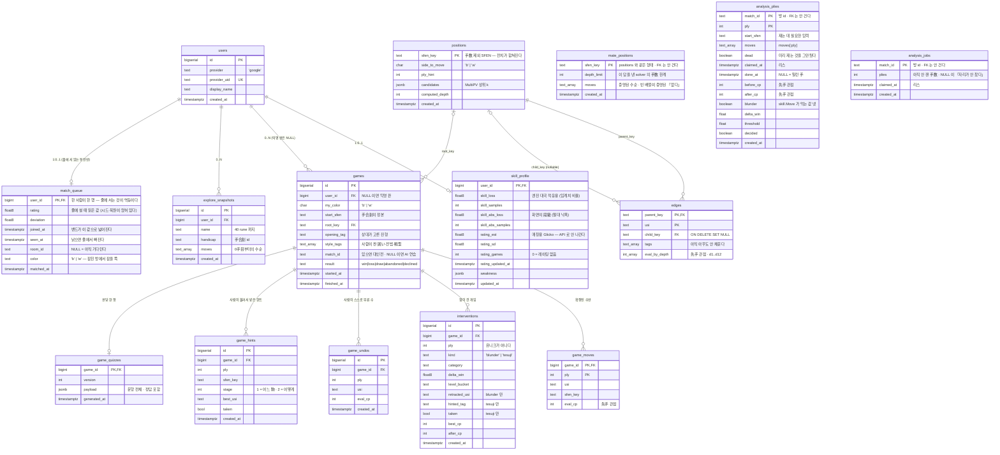
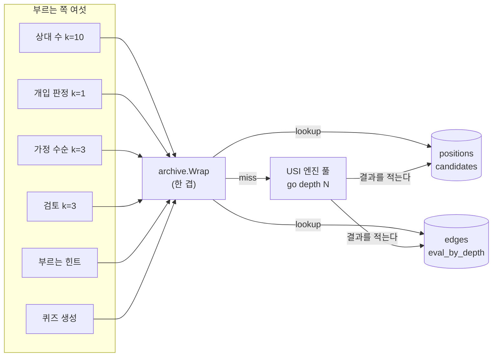

# 데이터 모델 — 표와 표 사이의 관계

**이 문서는 「무엇이 어떻게 생겼나」다.** 왜 그 모양인가는 [02-architecture §4](../02-architecture.md#4-데이터-모델--그래프-db를-쓰지-않는-이유)에 있고, 여기서 다시 쓰지 않는다 — 두 벌이면 한쪽이 조용히 낡는다.

정본은 `apps/server/internal/store/migrations/*.sql` 이고, 이 문서는 그 19개 파일을 한 장으로 본 것이다. **레포에 파일이 있는 것과 프로덕션에 적용된 것은 다르다** — 어디까지 적용됐는지는 [06-status §3](../06-status.md).

---

## 1. 전체 ERD



---

## 2. 세 덩어리로 갈린다

표가 15개인데 **서로 안 닿는 네 덩어리**다. 이 경계가 이 스키마의 전부다.

| 덩어리                  | 표                                                                                      | 키가 무엇인가 | 사람에 매여 있나     |
| ----------------------- | --------------------------------------------------------------------------------------- | ------------- | -------------------- |
| **사람** (4)            | `users` · `skill_profile` · `explore_snapshots` · `match_queue`                         | `user_id`     | 그렇다               |
| **판** (6)              | `games` · `game_moves` · `interventions` · `game_undos` · `game_hints` · `game_quizzes` | `game_id`     | `games.user_id` 로만 |
| **국면** (3, 엔진 캐시) | `positions` · `edges` · `mate_positions`                                                | `sfen_key`    | **아니다**           |
| **작업 줄** (2)         | `analysis_plies` · `analysis_jobs`                                                      | `match_id`    | **아니다**           |

**작업 줄은 넷째 덩어리다.** 둘 다 방 id 로 묶이고 사람에도 판 번호에도 안 매인다. 수명이 다른 셋과 다르다: **판이 끝나면 걷힌다**(`DiscardAnalysisMatch`·`DropAnalysisJob`). 기록이 아니라 아직 안 한 일이라서다.

**자리도 수순도 여기 다 적히지는 않는다.** `analysis_jobs` 가 자리를 안 드는 것은 `games` 행 둘이 곧 두 자리이기 때문이고([journal §118](../journal/101-120.md)), `analysis_plies` 가 수순을 드는 것은 `game_moves` 에 구멍이 날 수 있어서다([journal §115](../journal/101-120.md)). **가르는 기준은 「정본이 이미 있는가」다.**

**국면 덩어리에 `user_id`도 `game_id`도 없다.** cp는 手番 관점, `tags`는 둔 쪽 기준이라 A가 잰 국면이 B에게 그대로 유효하다 — 그래서 로그인이 붙어도 여기는 권한 검사 대상이 아니다. 판 덩어리는 반대다.

`games.root_key → positions.sfen_key` 가 두 덩어리를 잇는 유일한 FK인데, **이것도 판을 국면에 매달지는 않는다** — 시작 국면 하나를 가리키기만 한다.

---

## 3. 한 手数가 여러 표에 다른 값으로 들어간다

이 스키마에서 가장 틀리기 쉬운 자리다. **`game_moves` 는 「지금 판에 남아 있는 수순」이고, 물러진 수는 거기 없다.**

```
game_moves    ply 3 = 2g2f    ← 다시 둔 수 (확정)
interventions ply 3 = 8h3c+   ← 원래 두려던 수 (물러졌다)
game_undos    ply 3 = 3c3d    ← 사람이 스스로 무른 수
```

같은 `(game_id, ply)` 가 세 표에 다른 값으로 있는 것이 **정상**이다. 그래서:

- `interventions` 의 `(game_id, ply)` 는 **유니크가 아니다** — 한 국면에서 여러 번 물러진다
- `game_undos` 도 마찬가지다
- **되짚기 화면은 세 배열을 갈라서 받는다**(`moves` · `interventions` · `undos`) — 한 배열로 합치면 화면이 「앱이 막은 수」와 「사람이 스스로 무른 수」를 같은 줄로 그린다

**세 표를 갈라 둔 이유가 각각 다르다.**

| 표              | 시작한 쪽 | 판정을 통과했나 | 실력 추정에 들어가나   |
| --------------- | --------- | --------------- | ---------------------- |
| `interventions` | 앱        | 아니다 (걸렸다) | 들어간다 (신호다)      |
| `game_undos`    | 사람      | **통과했다**    | 안 빠진다              |
| `game_hints`    | 사람      | —               | **빠진다** (답을 봤다) |

---

## 4. 한 표에 척도가 셋 — `skill_profile`

**갈라 둔 이유는 비교 가능성 하나다.** 세 값은 단위가 다르고, 합칠 수 없다.

| 칸                              | 무엇             | 왜 갈렸나                                                              | 화면에 나가나               |
| ------------------------------- | ---------------- | ---------------------------------------------------------------------- | --------------------------- |
| `skill_loss` / `skill_samples`  | 엔진 대국 적응용 | **임계치에 대한 비율**이라 임계치가 사람마다 갈리면 사람끼리 못 견준다 | 아니다                      |
| `skill_abs_loss` / `_samples`   | 화면의 段級      | 임계치로 안 나눈 낙폭의 평균. 레벨이 갈려도 같은 값이다                | **그렇다**                  |
| `rating_est` / `_sd` / `_games` | 매칭용 Glicko    | 승패로만 움직여서 정의상 사람 사이의 값이다                            | **어느 API 도 안 돌려준다** |

- `skill_abs_loss = NULL` 이 「아직 모른다」다. 개수를 따로 세는 것은 `014` 이전 행이 `skill_samples` 만 차 있기 때문이다
- `rating_games = 0` 이 「레이팅 없음」이다 — `rating_est` 가 `NOT NULL DEFAULT 0` 이라 0으로는 그것을 못 말한다
- 21\~60手의 갈리지 않은 국면만 `skill_abs_loss` 에 센다

---

## 5. `result` 의 어휘 — DDL 이 안 막는다

`games.result` 에 **CHECK 제약이 없다.** 정본은 Go 쪽의 `store.GameResult` 이고, 그래서 `'declined'` 가 마이그레이션 없이 늘었다.

| 값          | 뜻                                    |
| ----------- | ------------------------------------- |
| `win`       | 사람이 이겼다                         |
| `loss`      | 사람이 졌다                           |
| `draw`      | 千日手                                |
| `abandoned` | 中断 — 연결이 끊겼고 이어할 수 있다   |
| `declined`  | 이어하기를 사람이 「いいえ」로 닫았다 |
| `NULL`      | 아직 두는 중                          |

> `aborted` 는 이 칸의 값이 **아니다** — 세션·프로토콜 쪽 `game.Status` 다. 표를 읽을 때 가장 흔히 섞이는 자리다.

---

## 6. `positions` · `edges` — 엔진 호출을 데이터로 바꾼 자리

**엔진을 부르는 자리를 전부 한 겹(`internal/archive`)으로 감쌌다.** 여섯 자리가 그 한 겹을 지난다 — 상대 수 · 개입 판정 · 가정 수순 · 검토 · 부르는 힌트 · 되짚기 퀴즈.



**캐시 판정은 깊이만으로는 모자란다.** 같은 깊이에서도 MultiPV가 갈리므로(k = 10 · 1 · 3), 질의는 **「같은 깊이면 후보가 많은 쪽이 이긴다」**로 되어 있다.

`edges.tags` 는 스키마에 있지만 **아무도 안 채운다.** 「정석 이탈」 카테고리가 기다리는 칸이고, 소비자 없이 스키마를 먼저 만든 값이 마이너스였다는 기록이 그 칸에 남아 있다.

### `eval_by_depth` 는 공짜로 얻는다

USI 엔진이 iterative deepening 중 `info depth 1 … / info depth 2 …` 를 계속 뱉으므로, **`go depth 12` 한 번의 info 라인을 깊이별로 주워담으면 그게 곧 이 배열**이다. 별도 탐색을 12번 돌리지 않는다.

이 배열의 소비자는 **개입 판정 하나**다. 얕은 평가(d2)와 깊은 평가(d12)의 차이가 곧 「초보자에게 보이는 것과 실제의 격차」이고, 그 격차의 **부호**가 개입의 두 방향을 정의한다.

| shallow (d2) | deep (d12) | 정체     | 개입              |
| ------------ | ---------- | -------- | ----------------- |
| 좋아 보임    | 실은 나쁨  | **함정** | 제지형 — 되무른다 |
| 나빠 보임    | 실은 좋음  | **手筋** | 제안형 — 알린다   |

> 단 얕은 값은 MultiPV info 라인에서 못 줍는다. 捨て駒는 얕은 깊이에서 상위 k에 안 들어와 애초에 라인에 없다 — 손해로 보이는 것이 그 수의 정의다. shallow 는 그 수를 둔 국면을 따로 depth 2로 재서 얻는다.

---

## 7. 지운 표 둘

| 표              | 언제  | 왜                                                                                   |
| --------------- | ----- | ------------------------------------------------------------------------------------ |
| `explain_cache` | `011` | 개입 문구가 LLM을 안 거치고 카테고리에서 결정적으로 나오게 되어 캐시할 것이 없어졌다 |
| `kb_chunks`     | `011` | 같은 이유. 프롬프트에 붙일 것이 없어졌다 (`vector(1536)` 컬럼도 함께 사라졌다)       |

`interventions.explain_tier` · `cost_yen` 도 같은 마이그레이션에서 빠졌다. **이 제품에서 LLM 계층이 있었다는 흔적은 마이그레이션 `003`·`004`의 seed 데이터에만 남아 있다** — 적용된 마이그레이션은 되돌려 고치지 않는 것이 규약이라 그렇다.

---

## 8. 마이그레이션 이력

| 번호  | 무엇                                                 | 종류               |
| ----- | ---------------------------------------------------- | ------------------ |
| `001` | 초기 8표 + `vector` 확장                             | 신규               |
| `002` | `games.user_id` NULL 허용 · `start_sfen` 추가        | 익명 대국          |
| `003` | `kb_chunks` seed (囲い·전법·手筋·블런더 카테고리)    | 데이터             |
| `004` | `explain_cache` seed                                 | 데이터             |
| `005` | `interventions.best_cp` · `after_cp`                 | 칸 추가            |
| `006` | `skill_profile.skill_loss` · `skill_samples`         | 칸 추가            |
| `007` | `game_quizzes`                                       | 표 추가            |
| `008` | `game_undos`                                         | 표 추가            |
| `009` | `games.style_tags` + GIN 인덱스                      | 칸 추가            |
| `010` | `game_hints`                                         | 표 추가            |
| `011` | **LLM 계층 제거** — 표 2개·칸 2개 DROP               | **되돌릴 수 없다** |
| `012` | `games.match_id` + 부분 인덱스                       | 칸 추가            |
| `013` | `skill_profile.rating_games` · `rating_updated_at`   | 칸 추가            |
| `014` | `skill_profile.skill_abs_loss` · `skill_abs_samples` | 칸 추가            |
| `015` | `explore_snapshots`                                  | 표 추가            |
| `016` | `match_queue` + 부분 인덱스                          | 표 추가            |
| `017` | `mate_positions`                                     | 표 추가            |
| `018` | `analysis_plies` + 부분 인덱스                       | 표 추가            |
| `019` | `analysis_jobs` + 부분 인덱스                        | 표 추가            |

**`011` 을 뺀 전부가 추가만 한다.** 그래서 워크트리를 병렬로 돌려도 다른 세션의 서버가 모른 채 그냥 돈다 — `DROP`·`RENAME`·`NOT NULL` 추가는 남의 서버를 그 자리에서 깨뜨리므로 혼자 돌린다.

**실행은 배포가 하지 않는다.** 파일을 PR로 올리고 사람이 DB 클라이언트로 직접 돌린다 — 절차는 [deploy/README.md](../../deploy/README.md) §4.
